# Summary

This directory contains the results of the target validation screening experiement, where we screened compounds with high affinities to our targets of interest in the ADPKD phenotypic assay. The analysis of the obtained data is performed in the notebook [ADPKD-TargetValidationScreening-analysis](ADPKD-TargetValidationScreening-analysis.ipynb).

Compounds listed herein were prioritized as described in the manuscript and on the notebooks within [02_TargetID_and_Prioritization](../02_TargetID_and_Prioritization/). For further transparency, we also report the affinity values of these screened compounds on our target of interest. The data used here is from ChEMBL.

For the full data, refer to [chembl_data_validation_compounds.csv](../figures/mol_structures/chembl_data_validation_compounds.csv).

# Known affinities of the screened compounds to targets of interest

| Target   | Compound Name   | img                                                         | assay_type   | standard_type   |   pchembl_value_mean |   pchembl_value_std |
|:---------|:----------------|:------------------------------------------------------------|:-------------|:----------------|---------------------:|--------------------:|
| ADORA1   | CPA             | 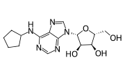                   | B            | Ki              |                 8.44 |                0.55 |
| ADORA1   | CPA             |                    | F            | IC50            |                 8.57 |                0    |
| ADORA1   | Capadenoson     | 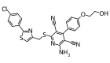   | B            | Ki              |                 8.85 |                0    |
| ADORA1   | DPCPX           | 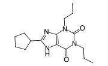               | B            | IC50            |                 8.1  |                0.57 |
| ADORA1   | DPCPX           |                | B            | Ki              |                 8.5  |                0.58 |
| ADORA1   | DPCPX           |                | F            | Ki              |                 9.33 |                0    |
| NR3C2    | Aldosterone     | 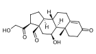   | B            | IC50            |                 9.52 |                0    |
| NR3C2    | Aldosterone     |    | F            | IC50            |                 8.03 |                0    |
| NR3C2    | Esaxerenone     |    | B            | IC50            |                 8.03 |                0    |
| NR3C2    | Esaxerenone     |    | F            | IC50            |                 8.62 |                0    |
| NR3C2    | Finerenone      | 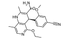     | B            | IC50            |                 7.5  |                0.25 |
| NR3C2    | Finerenone      |      | F            | IC50            |                 7.8  |                0    |
| P2X7     | AZD9056         |            | B            | IC50            |                 9.29 |                0.94 |
| P2X7     | JNJ-47965567    | 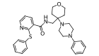 | B            | IC50            |                 7.57 |                0.52 |
| P2X7     | JNJ-47965567    |  | B            | Ki              |                 7.9  |                0    |
| SLC2A1   | Z211311146      | 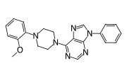     | B            | IC50            |                 7.57 |              nan    |
| SLC2A1   | Z4509024390     | 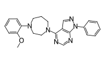   | B            | IC50            |                 8.4  |              nan    |

# Statistical Test Results

- Results for all the statistical comparisons represented in the plots available in the notebook [ADPKD-TargetValidationScreening-analysis](ADPKD-TargetValidationScreening-analysis.ipynb).

  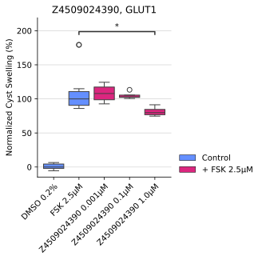

## Z4509024390 - Simulant (FSK) dose: 2.5µM
| group1           | group2                    | pvalue                | symbol   | test_description                     | target   |
|:-----------------|:--------------------------|:----------------------|:---------|:-------------------------------------|:---------|
| FSK 2.5µM, N(12) | Z4509024390 0.001µM, N(4) | $4.46 \times 10^{-1}$ | ns       | Mann-Whitney-Wilcoxon test two-sided | GLUT1    |
| FSK 2.5µM, N(12) | Z4509024390 0.1µM, N(4)   | $5.21 \times 10^{-1}$ | ns       | Mann-Whitney-Wilcoxon test two-sided | GLUT1    |
| FSK 2.5µM, N(12) | Z4509024390 1.0µM, N(4)   | $1.32 \times 10^{-2}$ | *        | Mann-Whitney-Wilcoxon test two-sided | GLUT1    |

  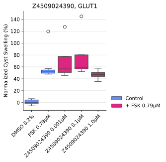

## Z4509024390 - Simulant (FSK) dose: 0.79µM
| group1           | group2                    | pvalue                | symbol   | test_description                     | target   |
|:-----------------|:--------------------------|:----------------------|:---------|:-------------------------------------|:---------|
| FSK 0.79µM, N(8) | Z4509024390 0.001µM, N(4) | $5.70 \times 10^{-1}$ | ns       | Mann-Whitney-Wilcoxon test two-sided | GLUT1    |
| FSK 0.79µM, N(8) | Z4509024390 0.1µM, N(4)   | $7.27 \times 10^{-2}$ | ns       | Mann-Whitney-Wilcoxon test two-sided | GLUT1    |
| FSK 0.79µM, N(8) | Z4509024390 1.0µM, N(4)   | $2.14 \times 10^{-1}$ | ns       | Mann-Whitney-Wilcoxon test two-sided | GLUT1    |

  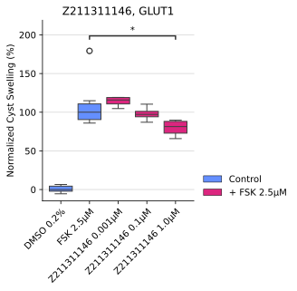

## Z211311146 - Simulant (FSK) dose: 2.5µM
| group1           | group2                   | pvalue                | symbol   | test_description                     | target   |
|:-----------------|:-------------------------|:----------------------|:---------|:-------------------------------------|:---------|
| FSK 2.5µM, N(12) | Z211311146 0.001µM, N(4) | $1.70 \times 10^{-1}$ | ns       | Mann-Whitney-Wilcoxon test two-sided | GLUT1    |
| FSK 2.5µM, N(12) | Z211311146 0.1µM, N(4)   | $7.70 \times 10^{-1}$ | ns       | Mann-Whitney-Wilcoxon test two-sided | GLUT1    |
| FSK 2.5µM, N(12) | Z211311146 1.0µM, N(4)   | $1.98 \times 10^{-2}$ | *        | Mann-Whitney-Wilcoxon test two-sided | GLUT1    |

  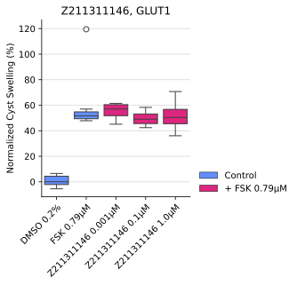

## Z211311146 - Simulant (FSK) dose: 0.79µM
| group1           | group2                   | pvalue                | symbol   | test_description                     | target   |
|:-----------------|:-------------------------|:----------------------|:---------|:-------------------------------------|:---------|
| FSK 0.79µM, N(8) | Z211311146 0.001µM, N(4) | $6.83 \times 10^{-1}$ | ns       | Mann-Whitney-Wilcoxon test two-sided | GLUT1    |
| FSK 0.79µM, N(8) | Z211311146 0.1µM, N(4)   | $4.61 \times 10^{-1}$ | ns       | Mann-Whitney-Wilcoxon test two-sided | GLUT1    |
| FSK 0.79µM, N(8) | Z211311146 1.0µM, N(4)   | $6.83 \times 10^{-1}$ | ns       | Mann-Whitney-Wilcoxon test two-sided | GLUT1    |

  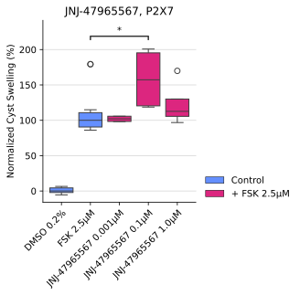

## JNJ-47965567 - Simulant (FSK) dose: 2.5µM
| group1           | group2                     | pvalue                | symbol   | test_description                     | target   |
|:-----------------|:---------------------------|:----------------------|:---------|:-------------------------------------|:---------|
| FSK 2.5µM, N(12) | JNJ-47965567 0.001µM, N(4) | $8.62 \times 10^{-1}$ | ns       | Mann-Whitney-Wilcoxon test two-sided | P2X7     |
| FSK 2.5µM, N(12) | JNJ-47965567 0.1µM, N(4)   | $1.32 \times 10^{-2}$ | *        | Mann-Whitney-Wilcoxon test two-sided | P2X7     |
| FSK 2.5µM, N(12) | JNJ-47965567 1.0µM, N(4)   | $3.16 \times 10^{-1}$ | ns       | Mann-Whitney-Wilcoxon test two-sided | P2X7     |

  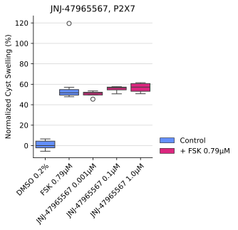

## JNJ-47965567 - Simulant (FSK) dose: 0.79µM
| group1           | group2                     | pvalue                | symbol   | test_description                     | target   |
|:-----------------|:---------------------------|:----------------------|:---------|:-------------------------------------|:---------|
| FSK 0.79µM, N(8) | JNJ-47965567 0.001µM, N(4) | $5.70 \times 10^{-1}$ | ns       | Mann-Whitney-Wilcoxon test two-sided | P2X7     |
| FSK 0.79µM, N(8) | JNJ-47965567 0.1µM, N(4)   | $2.83 \times 10^{-1}$ | ns       | Mann-Whitney-Wilcoxon test two-sided | P2X7     |
| FSK 0.79µM, N(8) | JNJ-47965567 1.0µM, N(4)   | $3.68 \times 10^{-1}$ | ns       | Mann-Whitney-Wilcoxon test two-sided | P2X7     |

  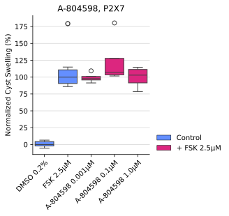

## A-804598 - Simulant (FSK) dose: 2.5µM
| group1           | group2                 | pvalue                | symbol   | test_description                     | target   |
|:-----------------|:-----------------------|:----------------------|:---------|:-------------------------------------|:---------|
| FSK 2.5µM, N(12) | A-804598 0.001µM, N(4) | $8.62 \times 10^{-1}$ | ns       | Mann-Whitney-Wilcoxon test two-sided | P2X7     |
| FSK 2.5µM, N(12) | A-804598 0.1µM, N(4)   | $2.12 \times 10^{-1}$ | ns       | Mann-Whitney-Wilcoxon test two-sided | P2X7     |
| FSK 2.5µM, N(12) | A-804598 1.0µM, N(4)   | $9.53 \times 10^{-1}$ | ns       | Mann-Whitney-Wilcoxon test two-sided | P2X7     |

  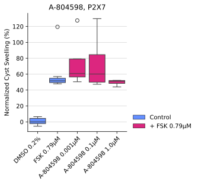

## A-804598 - Simulant (FSK) dose: 0.79µM
| group1           | group2                 | pvalue                | symbol   | test_description                     | target   |
|:-----------------|:-----------------------|:----------------------|:---------|:-------------------------------------|:---------|
| FSK 0.79µM, N(8) | A-804598 0.001µM, N(4) | $1.54 \times 10^{-1}$ | ns       | Mann-Whitney-Wilcoxon test two-sided | P2X7     |
| FSK 0.79µM, N(8) | A-804598 0.1µM, N(4)   | $8.08 \times 10^{-1}$ | ns       | Mann-Whitney-Wilcoxon test two-sided | P2X7     |
| FSK 0.79µM, N(8) | A-804598 1.0µM, N(4)   | $5.70 \times 10^{-1}$ | ns       | Mann-Whitney-Wilcoxon test two-sided | P2X7     |

  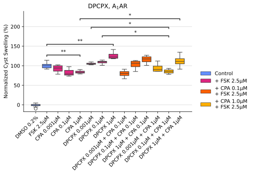

## DPCPX - Simulant (FSK) dose: 2.5µM
| group1                     | group2                       | pvalue                | symbol   | test_description                     | target                      |
|:---------------------------|:-----------------------------|:----------------------|:---------|:-------------------------------------|:----------------------------|
| FSK 2.5µM, N=11            | CPA 0.001µM, N=4             | $1.77 \times 10^{-1}$ | ns       | Mann-Whitney-Wilcoxon test two-sided | $\mathrm{A}_{1}\mathrm{AR}$ |
| FSK 2.5µM, N=11            | CPA 0.1µM, N=3               | $8.79 \times 10^{-2}$ | ns       | Mann-Whitney-Wilcoxon test two-sided | $\mathrm{A}_{1}\mathrm{AR}$ |
| DPCPX 0.1µM CPA 0.1µM, N=4 | DPCPX 0.001µM CPA 1µM, N=4   | $6.86 \times 10^{-1}$ | ns       | Mann-Whitney-Wilcoxon test two-sided | $\mathrm{A}_{1}\mathrm{AR}$ |
| FSK 2.5µM, N=11            | CPA 1µM, N=4                 | $1.47 \times 10^{-3}$ | **       | Mann-Whitney-Wilcoxon test two-sided | $\mathrm{A}_{1}\mathrm{AR}$ |
| DPCPX 1µM, N=4             | DPCPX 1µM CPA 0.1µM, N=4     | $4.86 \times 10^{-1}$ | ns       | Mann-Whitney-Wilcoxon test two-sided | $\mathrm{A}_{1}\mathrm{AR}$ |
| DPCPX 0.1µM, N=4           | DPCPX 0.1µM CPA 0.1µM, N=4   | $8.86 \times 10^{-1}$ | ns       | Mann-Whitney-Wilcoxon test two-sided | $\mathrm{A}_{1}\mathrm{AR}$ |
| DPCPX 1µM CPA 0.1µM, N=4   | DPCPX 1µM CPA 1µM, N=4       | $6.86 \times 10^{-1}$ | ns       | Mann-Whitney-Wilcoxon test two-sided | $\mathrm{A}_{1}\mathrm{AR}$ |
| DPCPX 0.1µM CPA 0.1µM, N=4 | DPCPX 0.1µM CPA 1µM, N=4     | $1.14 \times 10^{-1}$ | ns       | Mann-Whitney-Wilcoxon test two-sided | $\mathrm{A}_{1}\mathrm{AR}$ |
| FSK 2.5µM, N=11            | DPCPX 0.001µM, N=4           | $2.26 \times 10^{-1}$ | ns       | Mann-Whitney-Wilcoxon test two-sided | $\mathrm{A}_{1}\mathrm{AR}$ |
| DPCPX 0.001µM, N=4         | DPCPX 0.1µM CPA 0.1µM, N=4   | $1.00$                | ns       | Mann-Whitney-Wilcoxon test two-sided | $\mathrm{A}_{1}\mathrm{AR}$ |
| FSK 2.5µM, N=11            | DPCPX 0.1µM, N=4             | $1.04 \times 10^{-1}$ | ns       | Mann-Whitney-Wilcoxon test two-sided | $\mathrm{A}_{1}\mathrm{AR}$ |
| CPA 0.1µM, N=3             | DPCPX 0.001µM CPA 0.1µM, N=4 | $8.57 \times 10^{-1}$ | ns       | Mann-Whitney-Wilcoxon test two-sided | $\mathrm{A}_{1}\mathrm{AR}$ |
| FSK 2.5µM, N=11            | DPCPX 1µM, N=4               | $1.47 \times 10^{-3}$ | **       | Mann-Whitney-Wilcoxon test two-sided | $\mathrm{A}_{1}\mathrm{AR}$ |
| CPA 0.1µM, N=3             | DPCPX 0.1µM CPA 0.1µM, N=4   | $1.14 \times 10^{-1}$ | ns       | Mann-Whitney-Wilcoxon test two-sided | $\mathrm{A}_{1}\mathrm{AR}$ |
| DPCPX 1µM, N=4             | DPCPX 1µM CPA 1µM, N=4       | $2.00 \times 10^{-1}$ | ns       | Mann-Whitney-Wilcoxon test two-sided | $\mathrm{A}_{1}\mathrm{AR}$ |
| DPCPX 0.1µM, N=4           | DPCPX 0.1µM CPA 1µM, N=4     | $2.86 \times 10^{-2}$ | *        | Mann-Whitney-Wilcoxon test two-sided | $\mathrm{A}_{1}\mathrm{AR}$ |
| CPA 1µM, N=4               | DPCPX 0.001µM CPA 1µM, N=4   | $1.14 \times 10^{-1}$ | ns       | Mann-Whitney-Wilcoxon test two-sided | $\mathrm{A}_{1}\mathrm{AR}$ |
| CPA 0.1µM, N=3             | DPCPX 1µM CPA 0.1µM, N=4     | $5.71 \times 10^{-2}$ | ns       | Mann-Whitney-Wilcoxon test two-sided | $\mathrm{A}_{1}\mathrm{AR}$ |
| DPCPX 0.001µM, N=4         | DPCPX 0.1µM CPA 1µM, N=4     | $2.86 \times 10^{-2}$ | *        | Mann-Whitney-Wilcoxon test two-sided | $\mathrm{A}_{1}\mathrm{AR}$ |
| CPA 1µM, N=4               | DPCPX 0.1µM CPA 1µM, N=4     | $8.86 \times 10^{-1}$ | ns       | Mann-Whitney-Wilcoxon test two-sided | $\mathrm{A}_{1}\mathrm{AR}$ |
| CPA 1µM, N=4               | DPCPX 1µM CPA 1µM, N=4       | $2.86 \times 10^{-2}$ | *        | Mann-Whitney-Wilcoxon test two-sided | $\mathrm{A}_{1}\mathrm{AR}$ |

  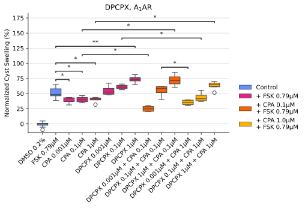

## DPCPX - Simulant (FSK) dose: 0.79µM
| group1                     | group2                       | pvalue                | symbol   | test_description                     | target                      |
|:---------------------------|:-----------------------------|:----------------------|:---------|:-------------------------------------|:----------------------------|
| FSK 0.79µM, N=8            | CPA 0.001µM, N=3             | $4.85 \times 10^{-2}$ | *        | Mann-Whitney-Wilcoxon test two-sided | $\mathrm{A}_{1}\mathrm{AR}$ |
| FSK 0.79µM, N=8            | CPA 0.1µM, N=4               | $2.83 \times 10^{-2}$ | *        | Mann-Whitney-Wilcoxon test two-sided | $\mathrm{A}_{1}\mathrm{AR}$ |
| DPCPX 0.1µM CPA 0.1µM, N=4 | DPCPX 0.001µM CPA 1µM, N=4   | $2.86 \times 10^{-2}$ | *        | Mann-Whitney-Wilcoxon test two-sided | $\mathrm{A}_{1}\mathrm{AR}$ |
| FSK 0.79µM, N=8            | CPA 1µM, N=4                 | $2.83 \times 10^{-2}$ | *        | Mann-Whitney-Wilcoxon test two-sided | $\mathrm{A}_{1}\mathrm{AR}$ |
| DPCPX 1µM, N=4             | DPCPX 1µM CPA 0.1µM, N=4     | $1.00$                | ns       | Mann-Whitney-Wilcoxon test two-sided | $\mathrm{A}_{1}\mathrm{AR}$ |
| DPCPX 0.1µM, N=4           | DPCPX 0.1µM CPA 0.1µM, N=4   | $3.43 \times 10^{-1}$ | ns       | Mann-Whitney-Wilcoxon test two-sided | $\mathrm{A}_{1}\mathrm{AR}$ |
| DPCPX 1µM CPA 0.1µM, N=4   | DPCPX 1µM CPA 1µM, N=4       | $3.43 \times 10^{-1}$ | ns       | Mann-Whitney-Wilcoxon test two-sided | $\mathrm{A}_{1}\mathrm{AR}$ |
| DPCPX 0.1µM CPA 0.1µM, N=4 | DPCPX 0.1µM CPA 1µM, N=4     | $1.14 \times 10^{-1}$ | ns       | Mann-Whitney-Wilcoxon test two-sided | $\mathrm{A}_{1}\mathrm{AR}$ |
| FSK 0.79µM, N=8            | DPCPX 0.001µM, N=4           | $4.61 \times 10^{-1}$ | ns       | Mann-Whitney-Wilcoxon test two-sided | $\mathrm{A}_{1}\mathrm{AR}$ |
| DPCPX 0.001µM, N=4         | DPCPX 0.1µM CPA 0.1µM, N=4   | $1.00$                | ns       | Mann-Whitney-Wilcoxon test two-sided | $\mathrm{A}_{1}\mathrm{AR}$ |
| FSK 0.79µM, N=8            | DPCPX 0.1µM, N=4             | $1.09 \times 10^{-1}$ | ns       | Mann-Whitney-Wilcoxon test two-sided | $\mathrm{A}_{1}\mathrm{AR}$ |
| CPA 0.1µM, N=4             | DPCPX 0.001µM CPA 0.1µM, N=4 | $2.86 \times 10^{-2}$ | *        | Mann-Whitney-Wilcoxon test two-sided | $\mathrm{A}_{1}\mathrm{AR}$ |
| FSK 0.79µM, N=8            | DPCPX 1µM, N=4               | $8.08 \times 10^{-3}$ | **       | Mann-Whitney-Wilcoxon test two-sided | $\mathrm{A}_{1}\mathrm{AR}$ |
| CPA 0.1µM, N=4             | DPCPX 0.1µM CPA 0.1µM, N=4   | $1.14 \times 10^{-1}$ | ns       | Mann-Whitney-Wilcoxon test two-sided | $\mathrm{A}_{1}\mathrm{AR}$ |
| DPCPX 1µM, N=4             | DPCPX 1µM CPA 1µM, N=4       | $1.14 \times 10^{-1}$ | ns       | Mann-Whitney-Wilcoxon test two-sided | $\mathrm{A}_{1}\mathrm{AR}$ |
| DPCPX 0.1µM, N=4           | DPCPX 0.1µM CPA 1µM, N=4     | $2.86 \times 10^{-2}$ | *        | Mann-Whitney-Wilcoxon test two-sided | $\mathrm{A}_{1}\mathrm{AR}$ |
| CPA 1µM, N=4               | DPCPX 0.001µM CPA 1µM, N=4   | $2.00 \times 10^{-1}$ | ns       | Mann-Whitney-Wilcoxon test two-sided | $\mathrm{A}_{1}\mathrm{AR}$ |
| CPA 0.1µM, N=4             | DPCPX 1µM CPA 0.1µM, N=4     | $2.86 \times 10^{-2}$ | *        | Mann-Whitney-Wilcoxon test two-sided | $\mathrm{A}_{1}\mathrm{AR}$ |
| DPCPX 0.001µM, N=4         | DPCPX 0.1µM CPA 1µM, N=4     | $1.14 \times 10^{-1}$ | ns       | Mann-Whitney-Wilcoxon test two-sided | $\mathrm{A}_{1}\mathrm{AR}$ |
| CPA 1µM, N=4               | DPCPX 0.1µM CPA 1µM, N=4     | $6.86 \times 10^{-1}$ | ns       | Mann-Whitney-Wilcoxon test two-sided | $\mathrm{A}_{1}\mathrm{AR}$ |
| CPA 1µM, N=4               | DPCPX 1µM CPA 1µM, N=4       | $2.86 \times 10^{-2}$ | *        | Mann-Whitney-Wilcoxon test two-sided | $\mathrm{A}_{1}\mathrm{AR}$ |

  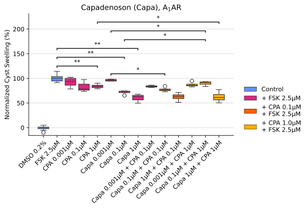

## Capadenoson - Simulant (FSK) dose: 2.5µM
| group1                           | group2                             | pvalue                | symbol   | test_description                     | target                      |
|:---------------------------------|:-----------------------------------|:----------------------|:---------|:-------------------------------------|:----------------------------|
| FSK 2.5µM, N=11                  | CPA 0.001µM, N=4                   | $1.77 \times 10^{-1}$ | ns       | Mann-Whitney-Wilcoxon test two-sided | $\mathrm{A}_{1}\mathrm{AR}$ |
| FSK 2.5µM, N=11                  | CPA 0.1µM, N=3                     | $8.79 \times 10^{-2}$ | ns       | Mann-Whitney-Wilcoxon test two-sided | $\mathrm{A}_{1}\mathrm{AR}$ |
| Capadenoson 0.1µM CPA 0.1µM, N=4 | Capadenoson 0.001µM CPA 1µM, N=4   | $5.71 \times 10^{-2}$ | ns       | Mann-Whitney-Wilcoxon test two-sided | $\mathrm{A}_{1}\mathrm{AR}$ |
| FSK 2.5µM, N=11                  | CPA 1µM, N=4                       | $1.47 \times 10^{-3}$ | **       | Mann-Whitney-Wilcoxon test two-sided | $\mathrm{A}_{1}\mathrm{AR}$ |
| Capadenoson 1µM, N=3             | Capadenoson 1µM CPA 0.1µM, N=4     | $8.57 \times 10^{-1}$ | ns       | Mann-Whitney-Wilcoxon test two-sided | $\mathrm{A}_{1}\mathrm{AR}$ |
| Capadenoson 0.1µM, N=4           | Capadenoson 0.1µM CPA 0.1µM, N=4   | $2.00 \times 10^{-1}$ | ns       | Mann-Whitney-Wilcoxon test two-sided | $\mathrm{A}_{1}\mathrm{AR}$ |
| Capadenoson 1µM CPA 0.1µM, N=4   | Capadenoson 1µM CPA 1µM, N=4       | $8.86 \times 10^{-1}$ | ns       | Mann-Whitney-Wilcoxon test two-sided | $\mathrm{A}_{1}\mathrm{AR}$ |
| Capadenoson 0.1µM CPA 0.1µM, N=4 | Capadenoson 0.1µM CPA 1µM, N=4     | $5.71 \times 10^{-2}$ | ns       | Mann-Whitney-Wilcoxon test two-sided | $\mathrm{A}_{1}\mathrm{AR}$ |
| FSK 2.5µM, N=11                  | Capadenoson 0.001µM, N=4           | $4.89 \times 10^{-1}$ | ns       | Mann-Whitney-Wilcoxon test two-sided | $\mathrm{A}_{1}\mathrm{AR}$ |
| Capadenoson 0.001µM, N=4         | Capadenoson 0.1µM CPA 0.1µM, N=4   | $2.86 \times 10^{-2}$ | *        | Mann-Whitney-Wilcoxon test two-sided | $\mathrm{A}_{1}\mathrm{AR}$ |
| FSK 2.5µM, N=11                  | Capadenoson 0.1µM, N=4             | $1.47 \times 10^{-3}$ | **       | Mann-Whitney-Wilcoxon test two-sided | $\mathrm{A}_{1}\mathrm{AR}$ |
| CPA 0.1µM, N=3                   | Capadenoson 0.001µM CPA 0.1µM, N=4 | $6.29 \times 10^{-1}$ | ns       | Mann-Whitney-Wilcoxon test two-sided | $\mathrm{A}_{1}\mathrm{AR}$ |
| FSK 2.5µM, N=11                  | Capadenoson 1µM, N=3               | $5.49 \times 10^{-3}$ | **       | Mann-Whitney-Wilcoxon test two-sided | $\mathrm{A}_{1}\mathrm{AR}$ |
| CPA 0.1µM, N=3                   | Capadenoson 0.1µM CPA 0.1µM, N=4   | $6.29 \times 10^{-1}$ | ns       | Mann-Whitney-Wilcoxon test two-sided | $\mathrm{A}_{1}\mathrm{AR}$ |
| Capadenoson 1µM, N=3             | Capadenoson 1µM CPA 1µM, N=4       | $8.57 \times 10^{-1}$ | ns       | Mann-Whitney-Wilcoxon test two-sided | $\mathrm{A}_{1}\mathrm{AR}$ |
| Capadenoson 0.1µM, N=4           | Capadenoson 0.1µM CPA 1µM, N=4     | $2.86 \times 10^{-2}$ | *        | Mann-Whitney-Wilcoxon test two-sided | $\mathrm{A}_{1}\mathrm{AR}$ |
| CPA 1µM, N=4                     | Capadenoson 0.001µM CPA 1µM, N=4   | $3.43 \times 10^{-1}$ | ns       | Mann-Whitney-Wilcoxon test two-sided | $\mathrm{A}_{1}\mathrm{AR}$ |
| CPA 0.1µM, N=3                   | Capadenoson 1µM CPA 0.1µM, N=4     | $5.71 \times 10^{-2}$ | ns       | Mann-Whitney-Wilcoxon test two-sided | $\mathrm{A}_{1}\mathrm{AR}$ |
| Capadenoson 0.001µM, N=4         | Capadenoson 0.1µM CPA 1µM, N=4     | $2.86 \times 10^{-2}$ | *        | Mann-Whitney-Wilcoxon test two-sided | $\mathrm{A}_{1}\mathrm{AR}$ |
| CPA 1µM, N=4                     | Capadenoson 0.1µM CPA 1µM, N=4     | $2.00 \times 10^{-1}$ | ns       | Mann-Whitney-Wilcoxon test two-sided | $\mathrm{A}_{1}\mathrm{AR}$ |
| CPA 1µM, N=4                     | Capadenoson 1µM CPA 1µM, N=4       | $2.86 \times 10^{-2}$ | *        | Mann-Whitney-Wilcoxon test two-sided | $\mathrm{A}_{1}\mathrm{AR}$ |

  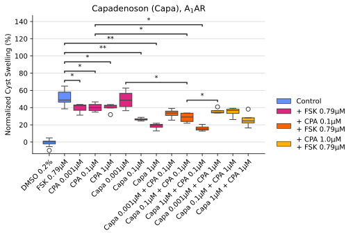

## Capadenoson - Simulant (FSK) dose: 0.79µM
| group1                           | group2                             | pvalue                | symbol   | test_description                     | target                      |
|:---------------------------------|:-----------------------------------|:----------------------|:---------|:-------------------------------------|:----------------------------|
| FSK 0.79µM, N=8                  | CPA 0.001µM, N=3                   | $4.85 \times 10^{-2}$ | *        | Mann-Whitney-Wilcoxon test two-sided | $\mathrm{A}_{1}\mathrm{AR}$ |
| FSK 0.79µM, N=8                  | CPA 0.1µM, N=4                     | $2.83 \times 10^{-2}$ | *        | Mann-Whitney-Wilcoxon test two-sided | $\mathrm{A}_{1}\mathrm{AR}$ |
| Capadenoson 0.1µM CPA 0.1µM, N=4 | Capadenoson 0.001µM CPA 1µM, N=4   | $2.86 \times 10^{-2}$ | *        | Mann-Whitney-Wilcoxon test two-sided | $\mathrm{A}_{1}\mathrm{AR}$ |
| FSK 0.79µM, N=8                  | CPA 1µM, N=4                       | $2.83 \times 10^{-2}$ | *        | Mann-Whitney-Wilcoxon test two-sided | $\mathrm{A}_{1}\mathrm{AR}$ |
| Capadenoson 1µM, N=4             | Capadenoson 1µM CPA 0.1µM, N=4     | $4.86 \times 10^{-1}$ | ns       | Mann-Whitney-Wilcoxon test two-sided | $\mathrm{A}_{1}\mathrm{AR}$ |
| Capadenoson 0.1µM, N=4           | Capadenoson 0.1µM CPA 0.1µM, N=4   | $8.86 \times 10^{-1}$ | ns       | Mann-Whitney-Wilcoxon test two-sided | $\mathrm{A}_{1}\mathrm{AR}$ |
| Capadenoson 1µM CPA 0.1µM, N=4   | Capadenoson 1µM CPA 1µM, N=4       | $1.14 \times 10^{-1}$ | ns       | Mann-Whitney-Wilcoxon test two-sided | $\mathrm{A}_{1}\mathrm{AR}$ |
| Capadenoson 0.1µM CPA 0.1µM, N=4 | Capadenoson 0.1µM CPA 1µM, N=4     | $1.14 \times 10^{-1}$ | ns       | Mann-Whitney-Wilcoxon test two-sided | $\mathrm{A}_{1}\mathrm{AR}$ |
| FSK 0.79µM, N=8                  | Capadenoson 0.001µM, N=4           | $5.70 \times 10^{-1}$ | ns       | Mann-Whitney-Wilcoxon test two-sided | $\mathrm{A}_{1}\mathrm{AR}$ |
| Capadenoson 0.001µM, N=4         | Capadenoson 0.1µM CPA 0.1µM, N=4   | $2.86 \times 10^{-2}$ | *        | Mann-Whitney-Wilcoxon test two-sided | $\mathrm{A}_{1}\mathrm{AR}$ |
| FSK 0.79µM, N=8                  | Capadenoson 0.1µM, N=4             | $4.04 \times 10^{-3}$ | **       | Mann-Whitney-Wilcoxon test two-sided | $\mathrm{A}_{1}\mathrm{AR}$ |
| CPA 0.1µM, N=4                   | Capadenoson 0.001µM CPA 0.1µM, N=4 | $2.00 \times 10^{-1}$ | ns       | Mann-Whitney-Wilcoxon test two-sided | $\mathrm{A}_{1}\mathrm{AR}$ |
| FSK 0.79µM, N=8                  | Capadenoson 1µM, N=4               | $4.04 \times 10^{-3}$ | **       | Mann-Whitney-Wilcoxon test two-sided | $\mathrm{A}_{1}\mathrm{AR}$ |
| CPA 0.1µM, N=4                   | Capadenoson 0.1µM CPA 0.1µM, N=4   | $2.86 \times 10^{-2}$ | *        | Mann-Whitney-Wilcoxon test two-sided | $\mathrm{A}_{1}\mathrm{AR}$ |
| Capadenoson 1µM, N=4             | Capadenoson 1µM CPA 1µM, N=4       | $2.00 \times 10^{-1}$ | ns       | Mann-Whitney-Wilcoxon test two-sided | $\mathrm{A}_{1}\mathrm{AR}$ |
| Capadenoson 0.1µM, N=4           | Capadenoson 0.1µM CPA 1µM, N=4     | $1.14 \times 10^{-1}$ | ns       | Mann-Whitney-Wilcoxon test two-sided | $\mathrm{A}_{1}\mathrm{AR}$ |
| CPA 1µM, N=4                     | Capadenoson 0.001µM CPA 1µM, N=4   | $3.43 \times 10^{-1}$ | ns       | Mann-Whitney-Wilcoxon test two-sided | $\mathrm{A}_{1}\mathrm{AR}$ |
| CPA 0.1µM, N=4                   | Capadenoson 1µM CPA 0.1µM, N=4     | $2.86 \times 10^{-2}$ | *        | Mann-Whitney-Wilcoxon test two-sided | $\mathrm{A}_{1}\mathrm{AR}$ |
| Capadenoson 0.001µM, N=4         | Capadenoson 0.1µM CPA 1µM, N=4     | $1.14 \times 10^{-1}$ | ns       | Mann-Whitney-Wilcoxon test two-sided | $\mathrm{A}_{1}\mathrm{AR}$ |
| CPA 1µM, N=4                     | Capadenoson 0.1µM CPA 1µM, N=4     | $2.00 \times 10^{-1}$ | ns       | Mann-Whitney-Wilcoxon test two-sided | $\mathrm{A}_{1}\mathrm{AR}$ |
| CPA 1µM, N=4                     | Capadenoson 1µM CPA 1µM, N=4       | $5.71 \times 10^{-2}$ | ns       | Mann-Whitney-Wilcoxon test two-sided | $\mathrm{A}_{1}\mathrm{AR}$ |

  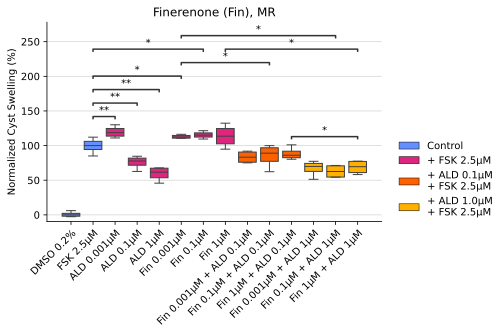

## Finerenone - Simulant (FSK) dose: 2.5µM
| group1                                  | group2                                    | pvalue                | symbol   | test_description                     | target   |
|:----------------------------------------|:------------------------------------------|:----------------------|:---------|:-------------------------------------|:---------|
| FSK 2.5µM, N=11                         | Aldosterone 0.001µM, N=4                  | $2.93 \times 10^{-3}$ | **       | Mann-Whitney-Wilcoxon test two-sided | MR       |
| FSK 2.5µM, N=11                         | Aldosterone 0.1µM, N=4                    | $1.47 \times 10^{-3}$ | **       | Mann-Whitney-Wilcoxon test two-sided | MR       |
| Finerenone 0.1µM Aldosterone 0.1µM, N=4 | Finerenone 0.001µM Aldosterone 1µM, N=4   | $2.00 \times 10^{-1}$ | ns       | Mann-Whitney-Wilcoxon test two-sided | MR       |
| FSK 2.5µM, N=11                         | Aldosterone 1µM, N=4                      | $1.47 \times 10^{-3}$ | **       | Mann-Whitney-Wilcoxon test two-sided | MR       |
| Finerenone 1µM, N=4                     | Finerenone 1µM Aldosterone 0.1µM, N=4     | $5.71 \times 10^{-2}$ | ns       | Mann-Whitney-Wilcoxon test two-sided | MR       |
| Finerenone 0.1µM, N=3                   | Finerenone 0.1µM Aldosterone 0.1µM, N=4   | $5.71 \times 10^{-2}$ | ns       | Mann-Whitney-Wilcoxon test two-sided | MR       |
| Finerenone 1µM Aldosterone 0.1µM, N=4   | Finerenone 1µM Aldosterone 1µM, N=4       | $2.86 \times 10^{-2}$ | *        | Mann-Whitney-Wilcoxon test two-sided | MR       |
| Finerenone 0.1µM Aldosterone 0.1µM, N=4 | Finerenone 0.1µM Aldosterone 1µM, N=4     | $1.14 \times 10^{-1}$ | ns       | Mann-Whitney-Wilcoxon test two-sided | MR       |
| FSK 2.5µM, N=11                         | Finerenone 0.001µM, N=4                   | $1.76 \times 10^{-2}$ | *        | Mann-Whitney-Wilcoxon test two-sided | MR       |
| Finerenone 0.001µM, N=4                 | Finerenone 0.1µM Aldosterone 0.1µM, N=4   | $2.86 \times 10^{-2}$ | *        | Mann-Whitney-Wilcoxon test two-sided | MR       |
| FSK 2.5µM, N=11                         | Finerenone 0.1µM, N=3                     | $2.20 \times 10^{-2}$ | *        | Mann-Whitney-Wilcoxon test two-sided | MR       |
| Aldosterone 0.1µM, N=4                  | Finerenone 0.001µM Aldosterone 0.1µM, N=4 | $3.43 \times 10^{-1}$ | ns       | Mann-Whitney-Wilcoxon test two-sided | MR       |
| FSK 2.5µM, N=11                         | Finerenone 1µM, N=4                       | $1.77 \times 10^{-1}$ | ns       | Mann-Whitney-Wilcoxon test two-sided | MR       |
| Aldosterone 0.1µM, N=4                  | Finerenone 0.1µM Aldosterone 0.1µM, N=4   | $4.86 \times 10^{-1}$ | ns       | Mann-Whitney-Wilcoxon test two-sided | MR       |
| Finerenone 1µM, N=4                     | Finerenone 1µM Aldosterone 1µM, N=4       | $2.86 \times 10^{-2}$ | *        | Mann-Whitney-Wilcoxon test two-sided | MR       |
| Finerenone 0.1µM, N=3                   | Finerenone 0.1µM Aldosterone 1µM, N=4     | $5.71 \times 10^{-2}$ | ns       | Mann-Whitney-Wilcoxon test two-sided | MR       |
| Aldosterone 1µM, N=4                    | Finerenone 0.001µM Aldosterone 1µM, N=4   | $4.86 \times 10^{-1}$ | ns       | Mann-Whitney-Wilcoxon test two-sided | MR       |
| Aldosterone 0.1µM, N=4                  | Finerenone 1µM Aldosterone 0.1µM, N=4     | $2.00 \times 10^{-1}$ | ns       | Mann-Whitney-Wilcoxon test two-sided | MR       |
| Finerenone 0.001µM, N=4                 | Finerenone 0.1µM Aldosterone 1µM, N=4     | $2.86 \times 10^{-2}$ | *        | Mann-Whitney-Wilcoxon test two-sided | MR       |
| Aldosterone 1µM, N=4                    | Finerenone 0.1µM Aldosterone 1µM, N=4     | $6.86 \times 10^{-1}$ | ns       | Mann-Whitney-Wilcoxon test two-sided | MR       |
| Aldosterone 1µM, N=4                    | Finerenone 1µM Aldosterone 1µM, N=4       | $3.43 \times 10^{-1}$ | ns       | Mann-Whitney-Wilcoxon test two-sided | MR       |

  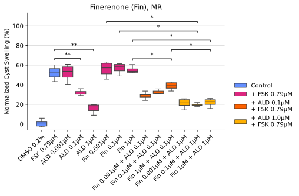

## Finerenone - Simulant (FSK) dose: 0.79µM
| group1                                  | group2                                    | pvalue                | symbol   | test_description                     | target   |
|:----------------------------------------|:------------------------------------------|:----------------------|:---------|:-------------------------------------|:---------|
| FSK 0.79µM, N=8                         | Aldosterone 0.001µM, N=4                  | $6.83 \times 10^{-1}$ | ns       | Mann-Whitney-Wilcoxon test two-sided | MR       |
| FSK 0.79µM, N=8                         | Aldosterone 0.1µM, N=4                    | $4.04 \times 10^{-3}$ | **       | Mann-Whitney-Wilcoxon test two-sided | MR       |
| Finerenone 0.1µM Aldosterone 0.1µM, N=3 | Finerenone 0.001µM Aldosterone 1µM, N=4   | $5.71 \times 10^{-2}$ | ns       | Mann-Whitney-Wilcoxon test two-sided | MR       |
| FSK 0.79µM, N=8                         | Aldosterone 1µM, N=4                      | $4.04 \times 10^{-3}$ | **       | Mann-Whitney-Wilcoxon test two-sided | MR       |
| Finerenone 1µM, N=4                     | Finerenone 1µM Aldosterone 0.1µM, N=4     | $2.86 \times 10^{-2}$ | *        | Mann-Whitney-Wilcoxon test two-sided | MR       |
| Finerenone 0.1µM, N=4                   | Finerenone 0.1µM Aldosterone 0.1µM, N=3   | $5.71 \times 10^{-2}$ | ns       | Mann-Whitney-Wilcoxon test two-sided | MR       |
| Finerenone 1µM Aldosterone 0.1µM, N=4   | Finerenone 1µM Aldosterone 1µM, N=4       | $2.86 \times 10^{-2}$ | *        | Mann-Whitney-Wilcoxon test two-sided | MR       |
| Finerenone 0.1µM Aldosterone 0.1µM, N=3 | Finerenone 0.1µM Aldosterone 1µM, N=4     | $5.71 \times 10^{-2}$ | ns       | Mann-Whitney-Wilcoxon test two-sided | MR       |
| FSK 0.79µM, N=8                         | Finerenone 0.001µM, N=4                   | $3.68 \times 10^{-1}$ | ns       | Mann-Whitney-Wilcoxon test two-sided | MR       |
| Finerenone 0.001µM, N=4                 | Finerenone 0.1µM Aldosterone 0.1µM, N=3   | $5.71 \times 10^{-2}$ | ns       | Mann-Whitney-Wilcoxon test two-sided | MR       |
| FSK 0.79µM, N=8                         | Finerenone 0.1µM, N=4                     | $1.54 \times 10^{-1}$ | ns       | Mann-Whitney-Wilcoxon test two-sided | MR       |
| Aldosterone 0.1µM, N=4                  | Finerenone 0.001µM Aldosterone 0.1µM, N=4 | $2.00 \times 10^{-1}$ | ns       | Mann-Whitney-Wilcoxon test two-sided | MR       |
| FSK 0.79µM, N=8                         | Finerenone 1µM, N=4                       | $5.70 \times 10^{-1}$ | ns       | Mann-Whitney-Wilcoxon test two-sided | MR       |
| Aldosterone 0.1µM, N=4                  | Finerenone 0.1µM Aldosterone 0.1µM, N=3   | $1.00$                | ns       | Mann-Whitney-Wilcoxon test two-sided | MR       |
| Finerenone 1µM, N=4                     | Finerenone 1µM Aldosterone 1µM, N=4       | $2.86 \times 10^{-2}$ | *        | Mann-Whitney-Wilcoxon test two-sided | MR       |
| Finerenone 0.1µM, N=4                   | Finerenone 0.1µM Aldosterone 1µM, N=4     | $2.86 \times 10^{-2}$ | *        | Mann-Whitney-Wilcoxon test two-sided | MR       |
| Aldosterone 1µM, N=4                    | Finerenone 0.001µM Aldosterone 1µM, N=4   | $2.00 \times 10^{-1}$ | ns       | Mann-Whitney-Wilcoxon test two-sided | MR       |
| Aldosterone 0.1µM, N=4                  | Finerenone 1µM Aldosterone 0.1µM, N=4     | $5.71 \times 10^{-2}$ | ns       | Mann-Whitney-Wilcoxon test two-sided | MR       |
| Finerenone 0.001µM, N=4                 | Finerenone 0.1µM Aldosterone 1µM, N=4     | $2.86 \times 10^{-2}$ | *        | Mann-Whitney-Wilcoxon test two-sided | MR       |
| Aldosterone 1µM, N=4                    | Finerenone 0.1µM Aldosterone 1µM, N=4     | $2.00 \times 10^{-1}$ | ns       | Mann-Whitney-Wilcoxon test two-sided | MR       |
| Aldosterone 1µM, N=4                    | Finerenone 1µM Aldosterone 1µM, N=4       | $1.14 \times 10^{-1}$ | ns       | Mann-Whitney-Wilcoxon test two-sided | MR       |

  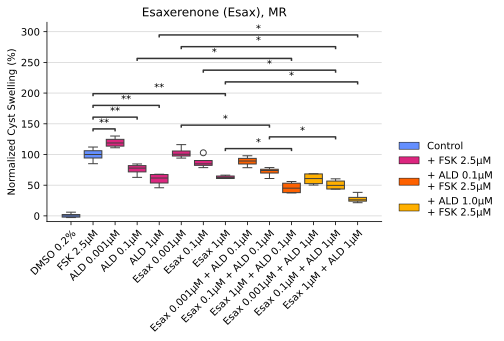

## Esaxerenone - Simulant (FSK) dose: 2.5µM
| group1                                   | group2                                     | pvalue                | symbol   | test_description                     | target   |
|:-----------------------------------------|:-------------------------------------------|:----------------------|:---------|:-------------------------------------|:---------|
| FSK 2.5µM, N=11                          | Aldosterone 0.001µM, N=4                   | $2.93 \times 10^{-3}$ | **       | Mann-Whitney-Wilcoxon test two-sided | MR       |
| FSK 2.5µM, N=11                          | Aldosterone 0.1µM, N=4                     | $1.47 \times 10^{-3}$ | **       | Mann-Whitney-Wilcoxon test two-sided | MR       |
| Esaxerenone 0.1µM Aldosterone 0.1µM, N=4 | Esaxerenone 0.001µM Aldosterone 1µM, N=4   | $1.14 \times 10^{-1}$ | ns       | Mann-Whitney-Wilcoxon test two-sided | MR       |
| FSK 2.5µM, N=11                          | Aldosterone 1µM, N=4                       | $1.47 \times 10^{-3}$ | **       | Mann-Whitney-Wilcoxon test two-sided | MR       |
| Esaxerenone 1µM, N=4                     | Esaxerenone 1µM Aldosterone 0.1µM, N=4     | $2.86 \times 10^{-2}$ | *        | Mann-Whitney-Wilcoxon test two-sided | MR       |
| Esaxerenone 0.1µM, N=4                   | Esaxerenone 0.1µM Aldosterone 0.1µM, N=4   | $5.71 \times 10^{-2}$ | ns       | Mann-Whitney-Wilcoxon test two-sided | MR       |
| Esaxerenone 1µM Aldosterone 0.1µM, N=4   | Esaxerenone 1µM Aldosterone 1µM, N=4       | $1.14 \times 10^{-1}$ | ns       | Mann-Whitney-Wilcoxon test two-sided | MR       |
| Esaxerenone 0.1µM Aldosterone 0.1µM, N=4 | Esaxerenone 0.1µM Aldosterone 1µM, N=4     | $2.86 \times 10^{-2}$ | *        | Mann-Whitney-Wilcoxon test two-sided | MR       |
| FSK 2.5µM, N=11                          | Esaxerenone 0.001µM, N=4                   | $7.53 \times 10^{-1}$ | ns       | Mann-Whitney-Wilcoxon test two-sided | MR       |
| Esaxerenone 0.001µM, N=4                 | Esaxerenone 0.1µM Aldosterone 0.1µM, N=4   | $2.86 \times 10^{-2}$ | *        | Mann-Whitney-Wilcoxon test two-sided | MR       |
| FSK 2.5µM, N=11                          | Esaxerenone 0.1µM, N=4                     | $7.77 \times 10^{-2}$ | ns       | Mann-Whitney-Wilcoxon test two-sided | MR       |
| Aldosterone 0.1µM, N=4                   | Esaxerenone 0.001µM Aldosterone 0.1µM, N=4 | $1.14 \times 10^{-1}$ | ns       | Mann-Whitney-Wilcoxon test two-sided | MR       |
| FSK 2.5µM, N=11                          | Esaxerenone 1µM, N=4                       | $1.47 \times 10^{-3}$ | **       | Mann-Whitney-Wilcoxon test two-sided | MR       |
| Aldosterone 0.1µM, N=4                   | Esaxerenone 0.1µM Aldosterone 0.1µM, N=4   | $4.86 \times 10^{-1}$ | ns       | Mann-Whitney-Wilcoxon test two-sided | MR       |
| Esaxerenone 1µM, N=4                     | Esaxerenone 1µM Aldosterone 1µM, N=4       | $2.86 \times 10^{-2}$ | *        | Mann-Whitney-Wilcoxon test two-sided | MR       |
| Esaxerenone 0.1µM, N=4                   | Esaxerenone 0.1µM Aldosterone 1µM, N=4     | $2.86 \times 10^{-2}$ | *        | Mann-Whitney-Wilcoxon test two-sided | MR       |
| Aldosterone 1µM, N=4                     | Esaxerenone 0.001µM Aldosterone 1µM, N=4   | $6.86 \times 10^{-1}$ | ns       | Mann-Whitney-Wilcoxon test two-sided | MR       |
| Aldosterone 0.1µM, N=4                   | Esaxerenone 1µM Aldosterone 0.1µM, N=4     | $2.86 \times 10^{-2}$ | *        | Mann-Whitney-Wilcoxon test two-sided | MR       |
| Esaxerenone 0.001µM, N=4                 | Esaxerenone 0.1µM Aldosterone 1µM, N=4     | $2.86 \times 10^{-2}$ | *        | Mann-Whitney-Wilcoxon test two-sided | MR       |
| Aldosterone 1µM, N=4                     | Esaxerenone 0.1µM Aldosterone 1µM, N=4     | $2.00 \times 10^{-1}$ | ns       | Mann-Whitney-Wilcoxon test two-sided | MR       |
| Aldosterone 1µM, N=4                     | Esaxerenone 1µM Aldosterone 1µM, N=4       | $2.86 \times 10^{-2}$ | *        | Mann-Whitney-Wilcoxon test two-sided | MR       |

  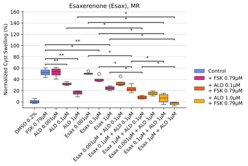

## Esaxerenone - Simulant (FSK) dose: 0.79µM
| group1                                   | group2                                     | pvalue                | symbol   | test_description                     | target   |
|:-----------------------------------------|:-------------------------------------------|:----------------------|:---------|:-------------------------------------|:---------|
| FSK 0.79µM, N=8                          | Aldosterone 0.001µM, N=4                   | $6.83 \times 10^{-1}$ | ns       | Mann-Whitney-Wilcoxon test two-sided | MR       |
| FSK 0.79µM, N=8                          | Aldosterone 0.1µM, N=4                     | $4.04 \times 10^{-3}$ | **       | Mann-Whitney-Wilcoxon test two-sided | MR       |
| Esaxerenone 0.1µM Aldosterone 0.1µM, N=4 | Esaxerenone 0.001µM Aldosterone 1µM, N=4   | $1.14 \times 10^{-1}$ | ns       | Mann-Whitney-Wilcoxon test two-sided | MR       |
| FSK 0.79µM, N=8                          | Aldosterone 1µM, N=4                       | $4.04 \times 10^{-3}$ | **       | Mann-Whitney-Wilcoxon test two-sided | MR       |
| Esaxerenone 1µM, N=4                     | Esaxerenone 1µM Aldosterone 0.1µM, N=4     | $2.86 \times 10^{-2}$ | *        | Mann-Whitney-Wilcoxon test two-sided | MR       |
| Esaxerenone 0.1µM, N=4                   | Esaxerenone 0.1µM Aldosterone 0.1µM, N=4   | $2.86 \times 10^{-2}$ | *        | Mann-Whitney-Wilcoxon test two-sided | MR       |
| Esaxerenone 1µM Aldosterone 0.1µM, N=4   | Esaxerenone 1µM Aldosterone 1µM, N=4       | $2.86 \times 10^{-2}$ | *        | Mann-Whitney-Wilcoxon test two-sided | MR       |
| Esaxerenone 0.1µM Aldosterone 0.1µM, N=4 | Esaxerenone 0.1µM Aldosterone 1µM, N=4     | $2.86 \times 10^{-2}$ | *        | Mann-Whitney-Wilcoxon test two-sided | MR       |
| FSK 0.79µM, N=8                          | Esaxerenone 0.001µM, N=4                   | $8.08 \times 10^{-1}$ | ns       | Mann-Whitney-Wilcoxon test two-sided | MR       |
| Esaxerenone 0.001µM, N=4                 | Esaxerenone 0.1µM Aldosterone 0.1µM, N=4   | $2.86 \times 10^{-2}$ | *        | Mann-Whitney-Wilcoxon test two-sided | MR       |
| FSK 0.79µM, N=8                          | Esaxerenone 0.1µM, N=4                     | $4.85 \times 10^{-2}$ | *        | Mann-Whitney-Wilcoxon test two-sided | MR       |
| Aldosterone 0.1µM, N=4                   | Esaxerenone 0.001µM Aldosterone 0.1µM, N=4 | $8.86 \times 10^{-1}$ | ns       | Mann-Whitney-Wilcoxon test two-sided | MR       |
| FSK 0.79µM, N=8                          | Esaxerenone 1µM, N=4                       | $4.04 \times 10^{-3}$ | **       | Mann-Whitney-Wilcoxon test two-sided | MR       |
| Aldosterone 0.1µM, N=4                   | Esaxerenone 0.1µM Aldosterone 0.1µM, N=4   | $2.00 \times 10^{-1}$ | ns       | Mann-Whitney-Wilcoxon test two-sided | MR       |
| Esaxerenone 1µM, N=4                     | Esaxerenone 1µM Aldosterone 1µM, N=4       | $2.86 \times 10^{-2}$ | *        | Mann-Whitney-Wilcoxon test two-sided | MR       |
| Esaxerenone 0.1µM, N=4                   | Esaxerenone 0.1µM Aldosterone 1µM, N=4     | $2.86 \times 10^{-2}$ | *        | Mann-Whitney-Wilcoxon test two-sided | MR       |
| Aldosterone 1µM, N=4                     | Esaxerenone 0.001µM Aldosterone 1µM, N=4   | $8.86 \times 10^{-1}$ | ns       | Mann-Whitney-Wilcoxon test two-sided | MR       |
| Aldosterone 0.1µM, N=4                   | Esaxerenone 1µM Aldosterone 0.1µM, N=4     | $2.86 \times 10^{-2}$ | *        | Mann-Whitney-Wilcoxon test two-sided | MR       |
| Esaxerenone 0.001µM, N=4                 | Esaxerenone 0.1µM Aldosterone 1µM, N=4     | $2.86 \times 10^{-2}$ | *        | Mann-Whitney-Wilcoxon test two-sided | MR       |
| Aldosterone 1µM, N=4                     | Esaxerenone 0.1µM Aldosterone 1µM, N=4     | $1.14 \times 10^{-1}$ | ns       | Mann-Whitney-Wilcoxon test two-sided | MR       |
| Aldosterone 1µM, N=4                     | Esaxerenone 1µM Aldosterone 1µM, N=4       | $2.86 \times 10^{-2}$ | *        | Mann-Whitney-Wilcoxon test two-sided | MR       |