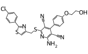
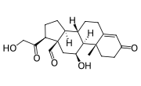
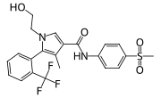
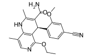
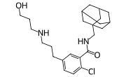
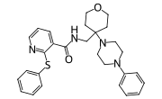

# Summary

This directory contains the results of the target validation screening experiement, where we screened compounds with high affinities to our targets of interest in the ADPKD phenotypic assay. The analysis of the obtained data is performed in the notebook [ADPKD-TargetValidationScreening-analysis](ADPKD-TargetValidationScreening-analysis.ipynb).

Compounds listed herein were prioritized as described in the manuscript and on the notebooks within [02_TargetID_and_Prioritization](../02_TargetID_and_Prioritization/). For further transparency, we also report the affinity values of these screened compounds on our target of interest. The data used here is from ChEMBL.

For the full data, refer to [chembl_data_validation_compounds.csv](../data/target_validation/compound_data/chembl_data_validation_compounds.csv).

# Known affinities of the screened compounds to targets of interest

| Target   | Compound Name   | img                                                                       | assay_type   | standard_type   |   pchembl_value_mean |   pchembl_value_std |
|:---------|:----------------|:--------------------------------------------------------------------------|:-------------|:----------------|---------------------:|--------------------:|
| ADORA1   | CPA             |                    | B            | Ki              |                 8.44 |                0.55 |
| ADORA1   | CPA             |                    | F            | IC50            |                 8.57 |                0    |
| ADORA1   | Capadenoson     |    | B            | Ki              |                 8.85 |                0    |
| ADORA1   | DPCPX           |                | B            | IC50            |                 8.1  |                0.57 |
| ADORA1   | DPCPX           |                | B            | Ki              |                 8.5  |                0.58 |
| ADORA1   | DPCPX           |                | F            | Ki              |                 9.33 |                0    |
| NR3C2    | Aldosterone     |    | B            | IC50            |                 9.52 |                0    |
| NR3C2    | Aldosterone     |    | F            | IC50            |                 8.03 |                0    |
| NR3C2    | Esaxerenone     |    | B            | IC50            |                 8.03 |                0    |
| NR3C2    | Esaxerenone     |    | F            | IC50            |                 8.62 |                0    |
| NR3C2    | Finerenone      |      | B            | IC50            |                 7.5  |                0.25 |
| NR3C2    | Finerenone      |      | F            | IC50            |                 7.8  |                0    |
| P2X7     | AZD9056         |            | B            | IC50            |                 9.29 |                0.94 |
| P2X7     | JNJ-47965567    |  | B            | IC50            |                 7.57 |                0.52 |
| P2X7     | JNJ-47965567    |  | B            | Ki              |                 7.9  |                0    |
| SLC2A1   | Z211311146      |      | B            | IC50            |                 7.57 |              nan    |
| SLC2A1   | Z4509024390     |    | B            | IC50            |                 8.4  |              nan    |