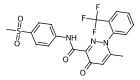
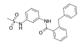
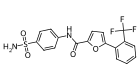

# Summary

This directory contains:
- Python [modules](modules) with methods used in this directory
- The [notebook](modelTrain-adora1_nr3c2.ipynb) for training the $\mathrm{A}_{1}\mathrm{AR}$ and $\mathrm{MR}$ models
- The hypermarameter optimization studies, stored in the [optuna_studies_dbs](optuna_studies_dbs) directory
- The optimized $\mathrm{MR}$ and $\mathrm{A}_{1}\mathrm{AR}$ serialized models, found in the [qsprModels](qsprModels) directory
- The [notebook](virtualScreening.ipynb) for performing the virtual screening
- The [notebook](ADPKD-ExplorationScreening-analysis.ipynb) for analyzing the spheroid swelling results on the ADPKD phenotypic assay

# Virtual Screening Results

These are the compounds selected for phenotypic screening based on the virtual screening results. For $\mathrm{A}_{1}\mathrm{AR}$, task variable consisted of solely pKi activity values, while for $\mathrm{MR}$, the training data consisted of both pIC50 and pKi values. These predicted values are represented as pChEMBL, as a placeholder for the -log10 transformed predicted activity values.

| Target   | Compound ID   | Structure                                               | Predicted pChEMBL value |
|:---------|:--------------|:--------------------------------------------------------|------------------------:|
| ADORA1   | 824745        |          |                    8.45 |
| ADORA1   | 1237561       |        |                    7.1  |
| ADORA1   | 1249141       |        |                    7.27 |
| ADORA1   | 1823372       |        |                    7.53 |
| ADORA1   | 22755240      |      |                    7.13 |
| ADORA1   | 27070328      |      |                    7.75 |
| NR3C2    | Z95680027     |    |                    7.32 |
| NR3C2    | Z318400112    |  |                    7.33 |
| NR3C2    | Z90308949     |    |                    7.09 |

# Statistical Test Results

- Results for all the statistical comparisons represented in the plots available in the notebook [ADPKD-ExplorationScreening-analysis](ADPKD-ExplorationScreening-analysis.ipynb).

## DPCPX - Simulant (FSK) dose: 2.5µM
| group1                | group2              | pvalue                | symbol   | test_description                     | target                      |
|:----------------------|:--------------------|:----------------------|:---------|:-------------------------------------|:----------------------------|
| FSK 2.5µM             | DPCPX 0.001µM       | $2.12 \times 10^{-1}$ | ns       | Mann-Whitney-Wilcoxon test two-sided | $\mathrm{A}_{1}\mathrm{AR}$ |
| DPCPX 0.001µM CPA 1µM | DPCPX 0.1µM CPA 1µM | $1.14 \times 10^{-1}$ | ns       | Mann-Whitney-Wilcoxon test two-sided | $\mathrm{A}_{1}\mathrm{AR}$ |
| DPCPX 0.001µM         | DPCPX 0.1µM         | $6.86 \times 10^{-1}$ | ns       | Mann-Whitney-Wilcoxon test two-sided | $\mathrm{A}_{1}\mathrm{AR}$ |
| DPCPX 0.1µM           | DPCPX 1µM           | $4.86 \times 10^{-1}$ | ns       | Mann-Whitney-Wilcoxon test two-sided | $\mathrm{A}_{1}\mathrm{AR}$ |
| FSK 2.5µM             | DPCPX 0.1µM         | $2.97 \times 10^{-2}$ | *        | Mann-Whitney-Wilcoxon test two-sided | $\mathrm{A}_{1}\mathrm{AR}$ |
| DPCPX 0.001µM CPA 1µM | DPCPX 1µM CPA 1µM   | $2.86 \times 10^{-2}$ | *        | Mann-Whitney-Wilcoxon test two-sided | $\mathrm{A}_{1}\mathrm{AR}$ |
| DPCPX 0.001µM         | DPCPX 1µM           | $1.14 \times 10^{-1}$ | ns       | Mann-Whitney-Wilcoxon test two-sided | $\mathrm{A}_{1}\mathrm{AR}$ |
| FSK 2.5µM             | DPCPX 1µM           | $1.32 \times 10^{-2}$ | *        | Mann-Whitney-Wilcoxon test two-sided | $\mathrm{A}_{1}\mathrm{AR}$ |

## Capadenoson - Simulant (FSK) dose: 2.5µM
| group1                      | group2                    | pvalue                | symbol   | test_description                     | target                      |
|:----------------------------|:--------------------------|:----------------------|:---------|:-------------------------------------|:----------------------------|
| FSK 2.5µM                   | Capadenoson 0.001µM       | $1.10 \times 10^{-3}$ | **       | Mann-Whitney-Wilcoxon test two-sided | $\mathrm{A}_{1}\mathrm{AR}$ |
| Capadenoson 0.001µM CPA 1µM | Capadenoson 0.1µM CPA 1µM | $2.00 \times 10^{-1}$ | ns       | Mann-Whitney-Wilcoxon test two-sided | $\mathrm{A}_{1}\mathrm{AR}$ |
| Capadenoson 0.001µM         | Capadenoson 0.1µM         | $2.86 \times 10^{-2}$ | *        | Mann-Whitney-Wilcoxon test two-sided | $\mathrm{A}_{1}\mathrm{AR}$ |
| Capadenoson 0.1µM           | Capadenoson 1µM           | $4.86 \times 10^{-1}$ | ns       | Mann-Whitney-Wilcoxon test two-sided | $\mathrm{A}_{1}\mathrm{AR}$ |
| FSK 2.5µM                   | Capadenoson 0.1µM         | $1.10 \times 10^{-3}$ | **       | Mann-Whitney-Wilcoxon test two-sided | $\mathrm{A}_{1}\mathrm{AR}$ |
| Capadenoson 0.001µM CPA 1µM | Capadenoson 1µM CPA 1µM   | $2.00 \times 10^{-1}$ | ns       | Mann-Whitney-Wilcoxon test two-sided | $\mathrm{A}_{1}\mathrm{AR}$ |
| Capadenoson 0.001µM         | Capadenoson 1µM           | $2.86 \times 10^{-2}$ | *        | Mann-Whitney-Wilcoxon test two-sided | $\mathrm{A}_{1}\mathrm{AR}$ |
| FSK 2.5µM                   | Capadenoson 1µM           | $1.10 \times 10^{-3}$ | **       | Mann-Whitney-Wilcoxon test two-sided | $\mathrm{A}_{1}\mathrm{AR}$ |

## MIPS521 - Simulant (FSK) dose: 2.5µM
| group1                  | group2                | pvalue                | symbol   | test_description                     | target                      |
|:------------------------|:----------------------|:----------------------|:---------|:-------------------------------------|:----------------------------|
| FSK 2.5µM               | MIPS521 0.001µM       | $4.46 \times 10^{-1}$ | ns       | Mann-Whitney-Wilcoxon test two-sided | $\mathrm{A}_{1}\mathrm{AR}$ |
| MIPS521 0.001µM CPA 1µM | MIPS521 0.1µM CPA 1µM | $2.86 \times 10^{-2}$ | *        | Mann-Whitney-Wilcoxon test two-sided | $\mathrm{A}_{1}\mathrm{AR}$ |
| MIPS521 0.001µM         | MIPS521 0.1µM         | $2.86 \times 10^{-2}$ | *        | Mann-Whitney-Wilcoxon test two-sided | $\mathrm{A}_{1}\mathrm{AR}$ |
| MIPS521 0.1µM           | MIPS521 1µM           | $2.86 \times 10^{-2}$ | *        | Mann-Whitney-Wilcoxon test two-sided | $\mathrm{A}_{1}\mathrm{AR}$ |
| FSK 2.5µM               | MIPS521 0.1µM         | $1.10 \times 10^{-3}$ | **       | Mann-Whitney-Wilcoxon test two-sided | $\mathrm{A}_{1}\mathrm{AR}$ |
| MIPS521 0.001µM CPA 1µM | MIPS521 1µM CPA 1µM   | $2.86 \times 10^{-2}$ | *        | Mann-Whitney-Wilcoxon test two-sided | $\mathrm{A}_{1}\mathrm{AR}$ |
| MIPS521 0.001µM         | MIPS521 1µM           | $2.86 \times 10^{-2}$ | *        | Mann-Whitney-Wilcoxon test two-sided | $\mathrm{A}_{1}\mathrm{AR}$ |
| FSK 2.5µM               | MIPS521 1µM           | $1.10 \times 10^{-3}$ | **       | Mann-Whitney-Wilcoxon test two-sided | $\mathrm{A}_{1}\mathrm{AR}$ |

## 824745 - Simulant (FSK) dose: 2.5µM
| group1                 | group2               | pvalue                | symbol   | test_description                     | target                      |
|:-----------------------|:---------------------|:----------------------|:---------|:-------------------------------------|:----------------------------|
| FSK 2.5µM              | 824745 0.001µM       | $6.17 \times 10^{-1}$ | ns       | Mann-Whitney-Wilcoxon test two-sided | $\mathrm{A}_{1}\mathrm{AR}$ |
| 824745 0.001µM CPA 1µM | 824745 0.1µM CPA 1µM | $2.00 \times 10^{-1}$ | ns       | Mann-Whitney-Wilcoxon test two-sided | $\mathrm{A}_{1}\mathrm{AR}$ |
| 824745 0.001µM         | 824745 0.1µM         | $8.86 \times 10^{-1}$ | ns       | Mann-Whitney-Wilcoxon test two-sided | $\mathrm{A}_{1}\mathrm{AR}$ |
| 824745 0.1µM           | 824745 1µM           | $1.14 \times 10^{-1}$ | ns       | Mann-Whitney-Wilcoxon test two-sided | $\mathrm{A}_{1}\mathrm{AR}$ |
| FSK 2.5µM              | 824745 0.1µM         | $4.94 \times 10^{-1}$ | ns       | Mann-Whitney-Wilcoxon test two-sided | $\mathrm{A}_{1}\mathrm{AR}$ |
| 824745 0.001µM CPA 1µM | 824745 1µM CPA 1µM   | $4.86 \times 10^{-1}$ | ns       | Mann-Whitney-Wilcoxon test two-sided | $\mathrm{A}_{1}\mathrm{AR}$ |
| 824745 0.001µM         | 824745 1µM           | $1.14 \times 10^{-1}$ | ns       | Mann-Whitney-Wilcoxon test two-sided | $\mathrm{A}_{1}\mathrm{AR}$ |
| FSK 2.5µM              | 824745 1µM           | $8.01 \times 10^{-2}$ | ns       | Mann-Whitney-Wilcoxon test two-sided | $\mathrm{A}_{1}\mathrm{AR}$ |

## 1237561 - Simulant (FSK) dose: 2.5µM
| group1                  | group2                | pvalue                | symbol   | test_description                     | target                      |
|:------------------------|:----------------------|:----------------------|:---------|:-------------------------------------|:----------------------------|
| FSK 2.5µM               | 1237561 0.001µM       | $2.49 \times 10^{-1}$ | ns       | Mann-Whitney-Wilcoxon test two-sided | $\mathrm{A}_{1}\mathrm{AR}$ |
| 1237561 0.001µM CPA 1µM | 1237561 0.1µM CPA 1µM | $3.43 \times 10^{-1}$ | ns       | Mann-Whitney-Wilcoxon test two-sided | $\mathrm{A}_{1}\mathrm{AR}$ |
| 1237561 0.001µM         | 1237561 0.1µM         | $4.86 \times 10^{-1}$ | ns       | Mann-Whitney-Wilcoxon test two-sided | $\mathrm{A}_{1}\mathrm{AR}$ |
| 1237561 0.1µM           | 1237561 1µM           | $3.43 \times 10^{-1}$ | ns       | Mann-Whitney-Wilcoxon test two-sided | $\mathrm{A}_{1}\mathrm{AR}$ |
| FSK 2.5µM               | 1237561 0.1µM         | $9.63 \times 10^{-1}$ | ns       | Mann-Whitney-Wilcoxon test two-sided | $\mathrm{A}_{1}\mathrm{AR}$ |
| 1237561 0.001µM CPA 1µM | 1237561 1µM CPA 1µM   | $2.86 \times 10^{-2}$ | *        | Mann-Whitney-Wilcoxon test two-sided | $\mathrm{A}_{1}\mathrm{AR}$ |
| 1237561 0.001µM         | 1237561 1µM           | $8.86 \times 10^{-1}$ | ns       | Mann-Whitney-Wilcoxon test two-sided | $\mathrm{A}_{1}\mathrm{AR}$ |
| FSK 2.5µM               | 1237561 1µM           | $2.90 \times 10^{-1}$ | ns       | Mann-Whitney-Wilcoxon test two-sided | $\mathrm{A}_{1}\mathrm{AR}$ |

## 1249141 - Simulant (FSK) dose: 2.5µM
| group1                  | group2                | pvalue                | symbol   | test_description                     | target                      |
|:------------------------|:----------------------|:----------------------|:---------|:-------------------------------------|:----------------------------|
| FSK 2.5µM               | 1249141 0.001µM       | $4.37 \times 10^{-1}$ | ns       | Mann-Whitney-Wilcoxon test two-sided | $\mathrm{A}_{1}\mathrm{AR}$ |
| 1249141 0.001µM CPA 1µM | 1249141 0.1µM CPA 1µM | $8.86 \times 10^{-1}$ | ns       | Mann-Whitney-Wilcoxon test two-sided | $\mathrm{A}_{1}\mathrm{AR}$ |
| 1249141 0.001µM         | 1249141 0.1µM         | $3.43 \times 10^{-1}$ | ns       | Mann-Whitney-Wilcoxon test two-sided | $\mathrm{A}_{1}\mathrm{AR}$ |
| 1249141 0.1µM           | 1249141 1µM           | $2.86 \times 10^{-2}$ | *        | Mann-Whitney-Wilcoxon test two-sided | $\mathrm{A}_{1}\mathrm{AR}$ |
| FSK 2.5µM               | 1249141 0.1µM         | $9.63 \times 10^{-1}$ | ns       | Mann-Whitney-Wilcoxon test two-sided | $\mathrm{A}_{1}\mathrm{AR}$ |
| 1249141 0.001µM CPA 1µM | 1249141 1µM CPA 1µM   | $2.00 \times 10^{-1}$ | ns       | Mann-Whitney-Wilcoxon test two-sided | $\mathrm{A}_{1}\mathrm{AR}$ |
| 1249141 0.001µM         | 1249141 1µM           | $1.14 \times 10^{-1}$ | ns       | Mann-Whitney-Wilcoxon test two-sided | $\mathrm{A}_{1}\mathrm{AR}$ |
| FSK 2.5µM               | 1249141 1µM           | $2.89 \times 10^{-3}$ | **       | Mann-Whitney-Wilcoxon test two-sided | $\mathrm{A}_{1}\mathrm{AR}$ |

## 1823372 - Simulant (FSK) dose: 2.5µM
| group1                  | group2                | pvalue                | symbol   | test_description                     | target                      |
|:------------------------|:----------------------|:----------------------|:---------|:-------------------------------------|:----------------------------|
| FSK 2.5µM               | 1823372 0.001µM       | $2.19 \times 10^{-2}$ | *        | Mann-Whitney-Wilcoxon test two-sided | $\mathrm{A}_{1}\mathrm{AR}$ |
| 1823372 0.001µM CPA 1µM | 1823372 0.1µM CPA 1µM | $6.86 \times 10^{-1}$ | ns       | Mann-Whitney-Wilcoxon test two-sided | $\mathrm{A}_{1}\mathrm{AR}$ |
| 1823372 0.001µM         | 1823372 0.1µM         | $1.14 \times 10^{-1}$ | ns       | Mann-Whitney-Wilcoxon test two-sided | $\mathrm{A}_{1}\mathrm{AR}$ |
| 1823372 0.1µM           | 1823372 1µM           | $6.86 \times 10^{-1}$ | ns       | Mann-Whitney-Wilcoxon test two-sided | $\mathrm{A}_{1}\mathrm{AR}$ |
| FSK 2.5µM               | 1823372 0.1µM         | $6.82 \times 10^{-1}$ | ns       | Mann-Whitney-Wilcoxon test two-sided | $\mathrm{A}_{1}\mathrm{AR}$ |
| 1823372 0.001µM CPA 1µM | 1823372 1µM CPA 1µM   | $1.14 \times 10^{-1}$ | ns       | Mann-Whitney-Wilcoxon test two-sided | $\mathrm{A}_{1}\mathrm{AR}$ |
| 1823372 0.001µM         | 1823372 1µM           | $1.14 \times 10^{-1}$ | ns       | Mann-Whitney-Wilcoxon test two-sided | $\mathrm{A}_{1}\mathrm{AR}$ |
| FSK 2.5µM               | 1823372 1µM           | $2.90 \times 10^{-1}$ | ns       | Mann-Whitney-Wilcoxon test two-sided | $\mathrm{A}_{1}\mathrm{AR}$ |

## 22755240 - Simulant (FSK) dose: 2.5µM
| group1                   | group2                 | pvalue                | symbol   | test_description                     | target                      |
|:-------------------------|:-----------------------|:----------------------|:---------|:-------------------------------------|:----------------------------|
| FSK 2.5µM                | 22755240 0.001µM       | $1.78 \times 10^{-1}$ | ns       | Mann-Whitney-Wilcoxon test two-sided | $\mathrm{A}_{1}\mathrm{AR}$ |
| 22755240 0.001µM CPA 1µM | 22755240 0.1µM CPA 1µM | $2.00 \times 10^{-1}$ | ns       | Mann-Whitney-Wilcoxon test two-sided | $\mathrm{A}_{1}\mathrm{AR}$ |
| 22755240 0.001µM         | 22755240 0.1µM         | $8.86 \times 10^{-1}$ | ns       | Mann-Whitney-Wilcoxon test two-sided | $\mathrm{A}_{1}\mathrm{AR}$ |
| 22755240 0.1µM           | 22755240 1µM           | $3.43 \times 10^{-1}$ | ns       | Mann-Whitney-Wilcoxon test two-sided | $\mathrm{A}_{1}\mathrm{AR}$ |
| FSK 2.5µM                | 22755240 0.1µM         | $4.94 \times 10^{-1}$ | ns       | Mann-Whitney-Wilcoxon test two-sided | $\mathrm{A}_{1}\mathrm{AR}$ |
| 22755240 0.001µM CPA 1µM | 22755240 1µM CPA 1µM   | $8.86 \times 10^{-1}$ | ns       | Mann-Whitney-Wilcoxon test two-sided | $\mathrm{A}_{1}\mathrm{AR}$ |
| 22755240 0.001µM         | 22755240 1µM           | $6.86 \times 10^{-1}$ | ns       | Mann-Whitney-Wilcoxon test two-sided | $\mathrm{A}_{1}\mathrm{AR}$ |
| FSK 2.5µM                | 22755240 1µM           | $9.95 \times 10^{-2}$ | ns       | Mann-Whitney-Wilcoxon test two-sided | $\mathrm{A}_{1}\mathrm{AR}$ |

## 27070328 - Simulant (FSK) dose: 2.5µM
| group1                   | group2                 | pvalue                | symbol   | test_description                     | target                      |
|:-------------------------|:-----------------------|:----------------------|:---------|:-------------------------------------|:----------------------------|
| FSK 2.5µM                | 27070328 0.001µM       | $1.78 \times 10^{-1}$ | ns       | Mann-Whitney-Wilcoxon test two-sided | $\mathrm{A}_{1}\mathrm{AR}$ |
| 27070328 0.001µM CPA 1µM | 27070328 0.1µM CPA 1µM | $5.71 \times 10^{-2}$ | ns       | Mann-Whitney-Wilcoxon test two-sided | $\mathrm{A}_{1}\mathrm{AR}$ |
| 27070328 0.001µM         | 27070328 0.1µM         | $2.86 \times 10^{-2}$ | *        | Mann-Whitney-Wilcoxon test two-sided | $\mathrm{A}_{1}\mathrm{AR}$ |
| 27070328 0.1µM           | 27070328 1µM           | $2.86 \times 10^{-2}$ | *        | Mann-Whitney-Wilcoxon test two-sided | $\mathrm{A}_{1}\mathrm{AR}$ |
| FSK 2.5µM                | 27070328 0.1µM         | $1.22 \times 10^{-1}$ | ns       | Mann-Whitney-Wilcoxon test two-sided | $\mathrm{A}_{1}\mathrm{AR}$ |
| 27070328 0.001µM CPA 1µM | 27070328 1µM CPA 1µM   | $2.86 \times 10^{-2}$ | *        | Mann-Whitney-Wilcoxon test two-sided | $\mathrm{A}_{1}\mathrm{AR}$ |
| 27070328 0.001µM         | 27070328 1µM           | $2.86 \times 10^{-2}$ | *        | Mann-Whitney-Wilcoxon test two-sided | $\mathrm{A}_{1}\mathrm{AR}$ |
| FSK 2.5µM                | 27070328 1µM           | $1.11 \times 10^{-2}$ | *        | Mann-Whitney-Wilcoxon test two-sided | $\mathrm{A}_{1}\mathrm{AR}$ |

## Finerenone - Simulant (FSK) dose: 2.5µM
| group1                             | group2                           | pvalue                | symbol   | test_description                     | target   |
|:-----------------------------------|:---------------------------------|:----------------------|:---------|:-------------------------------------|:---------|
| FSK 2.5µM                          | Finerenone 0.001µM               | $1.22 \times 10^{-1}$ | ns       | Mann-Whitney-Wilcoxon test two-sided | MR       |
| Finerenone 0.001µM Aldosterone 1µM | Finerenone 0.1µM Aldosterone 1µM | $6.86 \times 10^{-1}$ | ns       | Mann-Whitney-Wilcoxon test two-sided | MR       |
| Finerenone 0.001µM                 | Finerenone 0.1µM                 | $8.86 \times 10^{-1}$ | ns       | Mann-Whitney-Wilcoxon test two-sided | MR       |
| Finerenone 0.1µM                   | Finerenone 1µM                   | $4.86 \times 10^{-1}$ | ns       | Mann-Whitney-Wilcoxon test two-sided | MR       |
| FSK 2.5µM                          | Finerenone 0.1µM                 | $6.40 \times 10^{-2}$ | ns       | Mann-Whitney-Wilcoxon test two-sided | MR       |
| Finerenone 0.001µM Aldosterone 1µM | Finerenone 1µM Aldosterone 1µM   | $2.86 \times 10^{-2}$ | *        | Mann-Whitney-Wilcoxon test two-sided | MR       |
| Finerenone 0.001µM                 | Finerenone 1µM                   | $3.43 \times 10^{-1}$ | ns       | Mann-Whitney-Wilcoxon test two-sided | MR       |
| FSK 2.5µM                          | Finerenone 1µM                   | $1.11 \times 10^{-2}$ | *        | Mann-Whitney-Wilcoxon test two-sided | MR       |

## Esaxerenone - Simulant (FSK) dose: 2.5µM
| group1                              | group2                            | pvalue                | symbol   | test_description                     | target   |
|:------------------------------------|:----------------------------------|:----------------------|:---------|:-------------------------------------|:---------|
| FSK 2.5µM                           | Esaxerenone 0.001µM               | $2.90 \times 10^{-1}$ | ns       | Mann-Whitney-Wilcoxon test two-sided | MR       |
| Esaxerenone 0.001µM Aldosterone 1µM | Esaxerenone 0.1µM Aldosterone 1µM | $1.14 \times 10^{-1}$ | ns       | Mann-Whitney-Wilcoxon test two-sided | MR       |
| Esaxerenone 0.001µM                 | Esaxerenone 0.1µM                 | $6.86 \times 10^{-1}$ | ns       | Mann-Whitney-Wilcoxon test two-sided | MR       |
| Esaxerenone 0.1µM                   | Esaxerenone 1µM                   | $2.00 \times 10^{-1}$ | ns       | Mann-Whitney-Wilcoxon test two-sided | MR       |
| FSK 2.5µM                           | Esaxerenone 0.1µM                 | $8.92 \times 10^{-1}$ | ns       | Mann-Whitney-Wilcoxon test two-sided | MR       |
| Esaxerenone 0.001µM Aldosterone 1µM | Esaxerenone 1µM Aldosterone 1µM   | $5.71 \times 10^{-2}$ | ns       | Mann-Whitney-Wilcoxon test two-sided | MR       |
| Esaxerenone 0.001µM                 | Esaxerenone 1µM                   | $2.86 \times 10^{-2}$ | *        | Mann-Whitney-Wilcoxon test two-sided | MR       |
| FSK 2.5µM                           | Esaxerenone 1µM                   | $2.93 \times 10^{-2}$ | *        | Mann-Whitney-Wilcoxon test two-sided | MR       |

## Apararenone - Simulant (FSK) dose: 2.5µM
| group1                              | group2                            | pvalue                | symbol   | test_description                     | target   |
|:------------------------------------|:----------------------------------|:----------------------|:---------|:-------------------------------------|:---------|
| FSK 2.5µM                           | Apararenone 0.001µM               | $4.94 \times 10^{-1}$ | ns       | Mann-Whitney-Wilcoxon test two-sided | MR       |
| Apararenone 0.001µM Aldosterone 1µM | Apararenone 0.1µM Aldosterone 1µM | $4.86 \times 10^{-1}$ | ns       | Mann-Whitney-Wilcoxon test two-sided | MR       |
| Apararenone 0.001µM                 | Apararenone 0.1µM                 | $8.86 \times 10^{-1}$ | ns       | Mann-Whitney-Wilcoxon test two-sided | MR       |
| Apararenone 0.1µM                   | Apararenone 1µM                   | $8.86 \times 10^{-1}$ | ns       | Mann-Whitney-Wilcoxon test two-sided | MR       |
| FSK 2.5µM                           | Apararenone 0.1µM                 | $9.63 \times 10^{-1}$ | ns       | Mann-Whitney-Wilcoxon test two-sided | MR       |
| Apararenone 0.001µM Aldosterone 1µM | Apararenone 1µM Aldosterone 1µM   | $2.00 \times 10^{-1}$ | ns       | Mann-Whitney-Wilcoxon test two-sided | MR       |
| Apararenone 0.001µM                 | Apararenone 1µM                   | $1.00$                | ns       | Mann-Whitney-Wilcoxon test two-sided | MR       |
| FSK 2.5µM                           | Apararenone 1µM                   | $5.54 \times 10^{-1}$ | ns       | Mann-Whitney-Wilcoxon test two-sided | MR       |

## Benidipine - Simulant (FSK) dose: 2.5µM
| group1                             | group2                           | pvalue                | symbol   | test_description                     | target   |
|:-----------------------------------|:---------------------------------|:----------------------|:---------|:-------------------------------------|:---------|
| FSK 2.5µM                          | Benidipine 0.001µM               | $3.85 \times 10^{-1}$ | ns       | Mann-Whitney-Wilcoxon test two-sided | MR       |
| Benidipine 0.001µM Aldosterone 1µM | Benidipine 0.1µM Aldosterone 1µM | $8.86 \times 10^{-1}$ | ns       | Mann-Whitney-Wilcoxon test two-sided | MR       |
| Benidipine 0.001µM                 | Benidipine 0.1µM                 | $8.86 \times 10^{-1}$ | ns       | Mann-Whitney-Wilcoxon test two-sided | MR       |
| Benidipine 0.1µM                   | Benidipine 1µM                   | $1.14 \times 10^{-1}$ | ns       | Mann-Whitney-Wilcoxon test two-sided | MR       |
| FSK 2.5µM                          | Benidipine 0.1µM                 | $4.37 \times 10^{-1}$ | ns       | Mann-Whitney-Wilcoxon test two-sided | MR       |
| Benidipine 0.001µM Aldosterone 1µM | Benidipine 1µM Aldosterone 1µM   | $3.43 \times 10^{-1}$ | ns       | Mann-Whitney-Wilcoxon test two-sided | MR       |
| Benidipine 0.001µM                 | Benidipine 1µM                   | $2.00 \times 10^{-1}$ | ns       | Mann-Whitney-Wilcoxon test two-sided | MR       |
| FSK 2.5µM                          | Benidipine 1µM                   | $2.90 \times 10^{-1}$ | ns       | Mann-Whitney-Wilcoxon test two-sided | MR       |

## Z318400112 - Simulant (FSK) dose: 2.5µM
| group1                             | group2                           | pvalue                | symbol   | test_description                     | target   |
|:-----------------------------------|:---------------------------------|:----------------------|:---------|:-------------------------------------|:---------|
| FSK 2.5µM                          | Z318400112 0.001µM               | $4.94 \times 10^{-1}$ | ns       | Mann-Whitney-Wilcoxon test two-sided | MR       |
| Z318400112 0.001µM Aldosterone 1µM | Z318400112 0.1µM Aldosterone 1µM | $2.86 \times 10^{-2}$ | *        | Mann-Whitney-Wilcoxon test two-sided | MR       |
| Z318400112 0.001µM                 | Z318400112 0.1µM                 | $6.86 \times 10^{-1}$ | ns       | Mann-Whitney-Wilcoxon test two-sided | MR       |
| Z318400112 0.1µM                   | Z318400112 1µM                   | $1.00$                | ns       | Mann-Whitney-Wilcoxon test two-sided | MR       |
| FSK 2.5µM                          | Z318400112 0.1µM                 | $1.48 \times 10^{-1}$ | ns       | Mann-Whitney-Wilcoxon test two-sided | MR       |
| Z318400112 0.001µM Aldosterone 1µM | Z318400112 1µM Aldosterone 1µM   | $4.86 \times 10^{-1}$ | ns       | Mann-Whitney-Wilcoxon test two-sided | MR       |
| Z318400112 0.001µM                 | Z318400112 1µM                   | $4.86 \times 10^{-1}$ | ns       | Mann-Whitney-Wilcoxon test two-sided | MR       |
| FSK 2.5µM                          | Z318400112 1µM                   | $1.48 \times 10^{-1}$ | ns       | Mann-Whitney-Wilcoxon test two-sided | MR       |

## Z90308949 - Simulant (FSK) dose: 2.5µM
| group1                            | group2                          | pvalue                | symbol   | test_description                     | target   |
|:----------------------------------|:--------------------------------|:----------------------|:---------|:-------------------------------------|:---------|
| FSK 2.5µM                         | Z90308949 0.001µM               | $8.01 \times 10^{-2}$ | ns       | Mann-Whitney-Wilcoxon test two-sided | MR       |
| Z90308949 0.001µM Aldosterone 1µM | Z90308949 0.1µM Aldosterone 1µM | $8.86 \times 10^{-1}$ | ns       | Mann-Whitney-Wilcoxon test two-sided | MR       |
| Z90308949 0.001µM                 | Z90308949 0.1µM                 | $2.00 \times 10^{-1}$ | ns       | Mann-Whitney-Wilcoxon test two-sided | MR       |
| Z90308949 0.1µM                   | Z90308949 1µM                   | $2.00 \times 10^{-1}$ | ns       | Mann-Whitney-Wilcoxon test two-sided | MR       |
| FSK 2.5µM                         | Z90308949 0.1µM                 | $9.63 \times 10^{-1}$ | ns       | Mann-Whitney-Wilcoxon test two-sided | MR       |
| Z90308949 0.001µM Aldosterone 1µM | Z90308949 1µM Aldosterone 1µM   | $2.00 \times 10^{-1}$ | ns       | Mann-Whitney-Wilcoxon test two-sided | MR       |
| Z90308949 0.001µM                 | Z90308949 1µM                   | $5.71 \times 10^{-2}$ | ns       | Mann-Whitney-Wilcoxon test two-sided | MR       |
| FSK 2.5µM                         | Z90308949 1µM                   | $1.48 \times 10^{-1}$ | ns       | Mann-Whitney-Wilcoxon test two-sided | MR       |

## Z95680027 - Simulant (FSK) dose: 2.5µM
| group1                            | group2                          | pvalue                | symbol   | test_description                     | target   |
|:----------------------------------|:--------------------------------|:----------------------|:---------|:-------------------------------------|:---------|
| FSK 2.5µM                         | Z95680027 0.001µM               | $5.54 \times 10^{-1}$ | ns       | Mann-Whitney-Wilcoxon test two-sided | MR       |
| Z95680027 0.001µM Aldosterone 1µM | Z95680027 0.1µM Aldosterone 1µM | $2.86 \times 10^{-2}$ | *        | Mann-Whitney-Wilcoxon test two-sided | MR       |
| Z95680027 0.001µM                 | Z95680027 0.1µM                 | $1.00$                | ns       | Mann-Whitney-Wilcoxon test two-sided | MR       |
| Z95680027 0.1µM                   | Z95680027 1µM                   | $2.86 \times 10^{-2}$ | *        | Mann-Whitney-Wilcoxon test two-sided | MR       |
| FSK 2.5µM                         | Z95680027 0.1µM                 | $6.17 \times 10^{-1}$ | ns       | Mann-Whitney-Wilcoxon test two-sided | MR       |
| Z95680027 0.001µM Aldosterone 1µM | Z95680027 1µM Aldosterone 1µM   | $2.86 \times 10^{-2}$ | *        | Mann-Whitney-Wilcoxon test two-sided | MR       |
| Z95680027 0.001µM                 | Z95680027 1µM                   | $2.86 \times 10^{-2}$ | *        | Mann-Whitney-Wilcoxon test two-sided | MR       |
| FSK 2.5µM                         | Z95680027 1µM                   | $7.43 \times 10^{-3}$ | **       | Mann-Whitney-Wilcoxon test two-sided | MR       |
