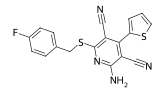
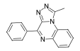
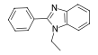
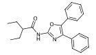
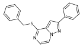
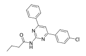

# A1R Screening results

The following table contains both predicted pKi and experimental pKi values for the ADORA1 compounds tested on the Compound Exploration ADPKD phenotypical screening experiment. Experimental pKi values were obtained from Radioligand displacement assay, as described in the paper.

| Target   | Compound ID   | Structure                                               | Predicted pKi | Experimental pKi |
|:---------|:--------------|:--------------------------------------------------------|--------------:|-----------------:|
| ADORA1   | 824745        |          |          8.45 |         9.4±0.06 |
| ADORA1   | 1237561       |        |          7.1  |        6.38±0.03 |
| ADORA1   | 1249141       |        |          7.27 |                - |
| ADORA1   | 1823372       |        |          7.53 |        7.36±0.04 |
| ADORA1   | 22755240      |      |          7.13 |        6.68±0.11 |
| ADORA1   | 27070328      |      |          7.75 |        7.61±0.04 |
