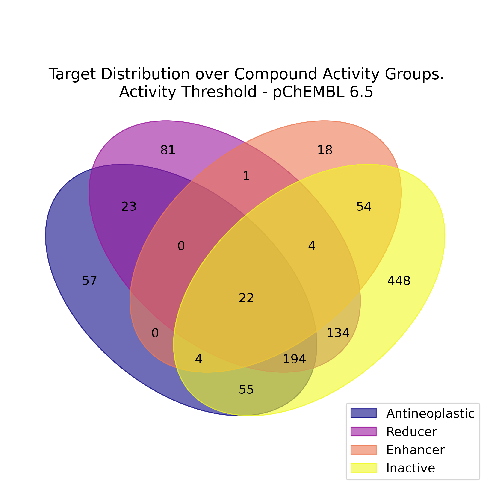
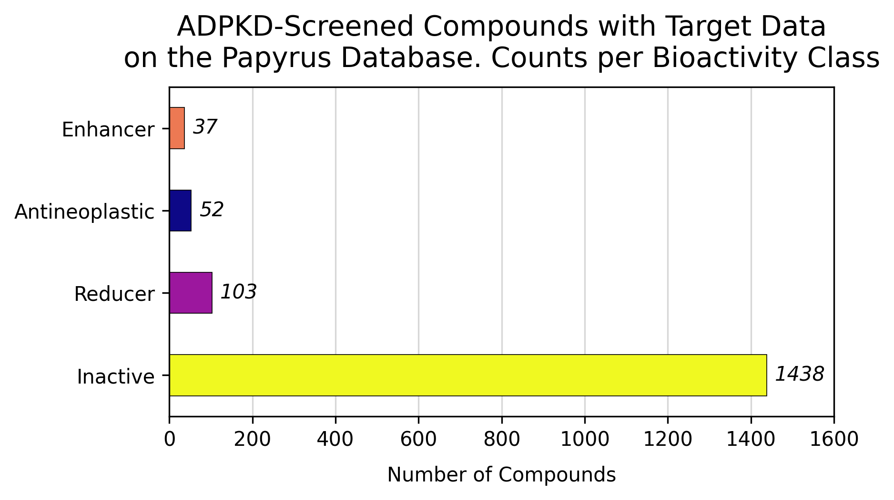
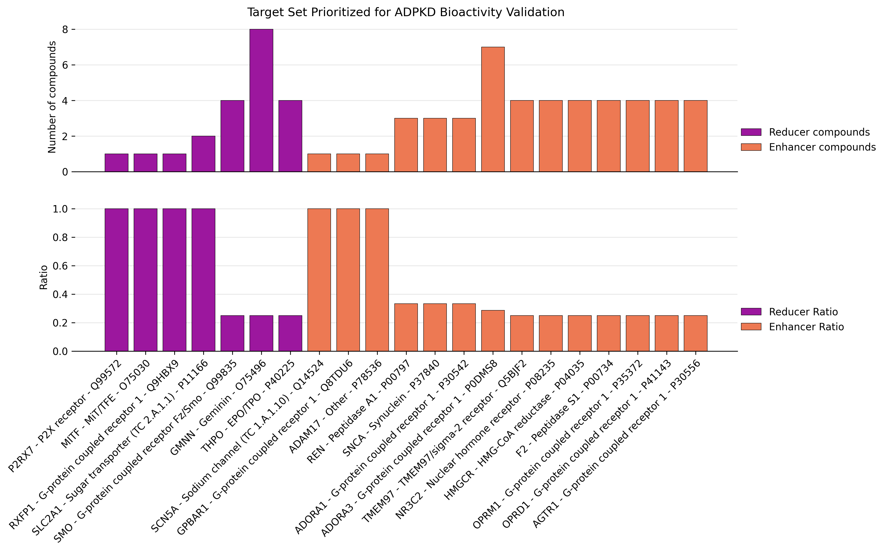

# cyst-to-target-and-back

Repository with the scripts used for the paper XXXX

Install:
```shell
micromamba env create -n cystToTarget python=3.10 -c conda-forge 
micromamba activate cystToTarget
python -m pip install qsprpred==3.0.2
python -m pip install statsmodels venn chembl_webresource_client pubchempy
python -m pip install papyrus-scripts==1.0.2 papyrus-structure-pipeline==0.0.4
python -m pip install -e .
```

# Structure

## Data

```text
data/
├── adpkd_screening/
│   ├── chem_structurs/
│   ├── screening_data/
│   └── standardized_structures/
│
├── anotherpart/
│   ├── dummy_file1.txt
│   └── dummy_file2.txt
```

## 01_ADPKD_ScreeningProcess

This directoriy contains the scripts used to process the ADPKD screening data coming from (Booij et al. 2017; Booij et al. 2020).

The scripts are:

### 1. `screening_process.py`

- Script to process the "raw" screening data, combine with the standardized structures, normalize and save the datasets. This script will produce datasets with all the chemical structures and the assay features, standardized as:
- `not_normalized_<dataset_name>.csv` - The dataset with the raw data.
- `npi_median_normalized_<dataset_name>.csv` - The dataset with the raw data normalized by NPI (normalized percent inhibition) as in the [KNIME node](https://nodepit.com/node/de.mpicbg.knime.hcs.base.nodes.norm.npi.NpiNormalizerNodeFactory).
- `z-score_median_normalized_<dataset_name>.csv` - The dataset with the raw data normalized by Z-score.
- `z-prime_median_stats_<dataset_name>.csv` - Z-prime statistics for each feature in the dataset.

Additionally, the script will perform hit identification anaylysis, with figures saved under `figures/hit_analysis/identified_hits/`. Correlations between hit-profiling values are also saved, with a dotted blue line indicating $median(DMSO+FSK) + 1.5 * MAD(DMSO+FSK)$ and a dotted red line on $median(DMSO+FSK) - 1.5 * MAD(DMSO+FSK)$, representing the thresholds for hit identification as cyst-swelling enhancers and reducers, respectively."

### 2. `hit_identification.py`

Script to identify the hits in the screening data using the NPI-normalized data produced by script `1`. The generated file is used for section [02_TargetID_and_Prioritization](#02_targetid_and_prioritization). The output file is stored in the `data/adpkd_screening/identified_hits/` directory:

- `pkd_HitCompounds_NPI-median-DefaultDistance-hitflag_as-isSMILES_<date>-<hour>.csv`: hits identified per-plate on the NPI-normalized data, according to the `default` distance threshold, with mutual distances of $median(DMSO+FSK) \pm MAD(DMSO+FSK)$.

## 02_TargetID_and_Prioritization

This directory contains the notebook used to identify the targets of the ADPKD-screened compounds, processed according to [01_ADPKD_ScreeningProcess](#01_adpkd_screeningprocess). A prioritization scheme is also performed for target selection.

### 1. `papyrus_data_linker.ipynb`

This notebooks performs the target identification and prioritization of the identified targets according to the ADPKD bioactivity. Three different plots are generated:

1. [A Venn diagram](figures/ADPKD-Bioactivity_and_TargetSpace.png) showing the overlap between targets and the four bioactivity classes (cyst-swelling enhancers, reducers, inactives and antineoplastic);
2. [Bar plot with N(compounds) per bioactivity class](figures/ADPKD-Compound_Bioactivity_Counts-Has_Papyrus_Data.png);
3. [Bar plot with the prioritized targets](figures/ADPKD-Prioritized_Target_Set.png). On the top part, the number of actives is shown ($N_{active}$), and on the bottom part, the Cyst Swelling (CS) bioactivity ratio: $CS_{ratio} = N_{active}/(N_{total})$, where $N_{total}$ is the total number of compounds for that target on the given threshold (default: $pchembl\_value < 6.5$)

<!-- 
<div align="left">
    
</div>
<div align="left">
    
</div>
<div align="left">
    
</div> -->

To reproduce the results and analysis, follow the steps in the notebook [papyrus_data_linker.ipynb](02_TargetID_and_Prioritization/papyrus_data_linker.ipynb).

## 03_Target_Validation

TODO

## 04_Virtual_Screening

TODO

## 05_Adenosine_Receptor_Screening

TODO