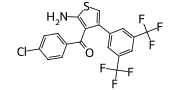
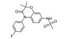
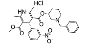

| Target                      | Compound ID | Structure                                                 | Activity Parameter   | pChEMBL (nM)    |
|:----------------------------|:------------|:----------------------------------------------------------|:---------------------|:----------------|
| $\mathrm{A}_{1}\mathrm{AR}$ | 824745      |            | QSAR-assessed        | 8.45 (3.55 nM)  |
| $\mathrm{A}_{1}\mathrm{AR}$ | 1237561     |          | QSAR-assessed        | 7.1 (79.43 nM)  |
| $\mathrm{A}_{1}\mathrm{AR}$ | 1249141     |          | QSAR-assessed        | 7.27 (53.70 nM) |
| $\mathrm{A}_{1}\mathrm{AR}$ | 1823372     |          | QSAR-assessed        | 7.53 (29.51 nM) |
| $\mathrm{A}_{1}\mathrm{AR}$ | 22755240    |        | QSAR-assessed        | 7.13 (74.13 nM) |
| $\mathrm{A}_{1}\mathrm{AR}$ | 27070328    |        | QSAR-assessed        | 7.75 (17.78 nM) |
| $\mathrm{A}_{1}\mathrm{AR}$ | MIPS521     |          | $\mathrm{K}_{b}$     | 4.95 (1100 nM)  |
| MR                          | Z90308949   |      | QSAR-assessed        | 7.09 (81.28 nM) |
| MR                          | Z95680027   |      | QSAR-assessed        | 7.32 (47.86 nM) |
| MR                          | Z318400112  |    | QSAR-assessed        | 7.33 (46.77 nM) |
| MR                          | Apararenone |  | $\mathrm{IC}_{50}$   | 6.59 (256 nM)   |
| MR                          | Benidipine  |    | $\mathrm{IC}_{50}$   | 6.10 (790 nM)   |